# Current Backend ERD

This document summarizes the database tables created by the current Flyway migrations under `apps/backend/src/main/resources/db/migration`.

- Application database name used by local/test settings: `cashchat`
- Schema source of truth: `V1__baseline_schema.sql` through `V10__quality.sql`
- Flyway may also create its own metadata table: `flyway_schema_history`

## Table List

| Domain | Table | Purpose |
|--------|-------|---------|
| User/Auth | `users` | User account, OAuth/guest identity, role, profile |
| User/Auth | `refresh_tokens` | Refresh token persistence |
| Points | `user_points` | Current point balance per user |
| Points | `point_transaction` | Point ledger for grants/spends with idempotency |
| Chat | `conversations` | Chat rooms owned by users |
| Chat | `chat_messages` | Persisted user/assistant messages |
| Attendance | `attendance_log` | Daily check-in logs |
| Attendance | `attendance_reward` | Attendance reward rules by streak day |
| Attendance | `attendance_reward_bonus` | Bonus item rewards for attendance milestones |
| Ads | `google_ad_ssv_events` | Google AdMob SSV callback events |
| Ads | `ad_reward_nonce` | Server-issued rewarded-ad nonces |
| Ads | `ad_reward_daily_quota` | Per-user daily rewarded-ad quota |
| Shop | `shop_item` | Shop catalog item master data |
| Shop | `shop_item_grant` | Item grant mapping for shop purchases |
| Shop | `purchase_order` | Shop purchase orders |
| Inventory | `user_inventory` | User-owned item quantities |
| Evolution | `user_evolution` | Current character/evolution level per user |
| Evolution | `evolution_attempt` | Evolution attempt history |
| Energy | `user_energy` | Current chat energy per user |
| Ledger | `ledger_entry` | Revenue distribution/accounting entries |
| Quality | `shared_quality_pool` | Shared premium quality resource pool |
| Quality | `daily_premium_usage` | Per-user daily premium usage count |

## Text ERD

Use this section when your Markdown viewer does not render Mermaid diagrams.

```text
users
├─ refresh_tokens
├─ user_points
├─ point_transaction
├─ conversations
│  └─ chat_messages
├─ attendance_log
├─ ad_reward_nonce
├─ ad_reward_daily_quota
├─ purchase_order
├─ user_inventory
├─ user_evolution
├─ evolution_attempt
├─ user_energy
├─ ledger_entry
└─ daily_premium_usage

attendance_reward
└─ attendance_reward_bonus

shop_item
└─ shop_item_grant

standalone / no declared FK
├─ google_ad_ssv_events
└─ shared_quality_pool
```

## Relationship Summary

| Parent | Child | Cardinality | Join / Constraint |
|--------|-------|-------------|-------------------|
| `users` | `refresh_tokens` | 1:N | `refresh_tokens.user_id -> users.id` |
| `users` | `user_points` | 1:1 | `user_points.user_id -> users.id`, unique |
| `users` | `point_transaction` | 1:N | `point_transaction.user_id -> users.id` |
| `users` | `conversations` | 1:N | `conversations.user_id -> users.id` |
| `conversations` | `chat_messages` | 1:N | `chat_messages.conversation_id -> conversations.id` |
| `users` | `attendance_log` | 1:N | `attendance_log.user_id -> users.id` |
| `attendance_reward` | `attendance_reward_bonus` | 1:N | `attendance_reward_bonus.day_count -> attendance_reward.day_count` |
| `users` | `ad_reward_nonce` | 1:N | `ad_reward_nonce.user_id -> users.id` |
| `users` | `ad_reward_daily_quota` | 1:N | `ad_reward_daily_quota.user_id -> users.id` |
| `shop_item` | `shop_item_grant` | 1:N | `shop_item_grant.item_code -> shop_item.item_code` |
| `users` | `purchase_order` | 1:N | `purchase_order.user_id -> users.id` |
| `users` | `user_inventory` | 1:N | `user_inventory.user_id -> users.id` |
| `users` | `user_evolution` | 1:1 | `user_evolution.user_id -> users.id`, unique |
| `users` | `evolution_attempt` | 1:N | `evolution_attempt.user_id -> users.id` |
| `users` | `user_energy` | 1:1 | `user_energy.user_id -> users.id`, unique |
| `users` | `ledger_entry` | 1:N | `ledger_entry.user_id -> users.id` |
| `users` | `daily_premium_usage` | 1:N | `daily_premium_usage.user_id -> users.id` |

Notes:

- `google_ad_ssv_events.user_id` stores the callback payload user id as text and has no declared FK.
- `shared_quality_pool` is a singleton table seeded with `id = 1`.
- `purchase_order.item_code`, `user_inventory.item_code`, and `shop_item_grant.grant_item_code` are item codes but have no declared FK in the current migration.

## Mermaid ERD

If your viewer supports Mermaid, the same schema is rendered below.

```mermaid
erDiagram
    users {
        BIGINT id PK
        VARCHAR role
        VARCHAR device_token UK
        VARCHAR provider
        VARCHAR provider_id
        VARCHAR email
        VARCHAR name
        VARCHAR profile_image_url
        TIMESTAMP created_at
        TIMESTAMP updated_at
    }

    refresh_tokens {
        BIGINT id PK
        BIGINT user_id FK
        VARCHAR token UK
        TIMESTAMP created_at
        TIMESTAMP expires_at
    }

    user_points {
        BIGINT id PK
        BIGINT user_id FK,UK
        BIGINT balance
        TIMESTAMP created_at
        TIMESTAMP updated_at
    }

    point_transaction {
        BIGINT id PK
        BIGINT user_id FK
        BIGINT delta
        BIGINT balance_after
        VARCHAR reason
        VARCHAR idempotency_key UK
        TIMESTAMP created_at
        TIMESTAMP updated_at
    }

    conversations {
        BIGINT id PK
        BINARY uuid UK
        BIGINT user_id FK
        VARCHAR title
        TIMESTAMP created_at
        TIMESTAMP updated_at
    }

    chat_messages {
        BIGINT id PK
        BIGINT conversation_id FK
        VARCHAR role
        TEXT content
        VARCHAR status
        VARCHAR model
        TIMESTAMP created_at
        TIMESTAMP updated_at
    }

    attendance_log {
        BIGINT id PK
        BIGINT user_id FK
        DATE check_in_date
        INT streak_day_count
        TIMESTAMP created_at
        TIMESTAMP updated_at
    }

    attendance_reward {
        INT day_count PK
        BIGINT coin
    }

    attendance_reward_bonus {
        BIGINT id PK
        INT day_count FK
        VARCHAR item_code
        INT quantity
    }

    google_ad_ssv_events {
        BIGINT id PK
        VARCHAR transaction_id UK
        VARCHAR user_id
        INT reward_amount
        VARCHAR reward_item
        VARCHAR ad_unit
        BIGINT key_id
        VARCHAR reward_status
        TEXT raw_query_string
        TIMESTAMP created_at
        TIMESTAMP updated_at
    }

    ad_reward_nonce {
        VARCHAR nonce PK
        BIGINT user_id FK
        TIMESTAMP expires_at
        BOOLEAN used
        TIMESTAMP created_at
        TIMESTAMP updated_at
    }

    ad_reward_daily_quota {
        BIGINT user_id PK,FK
        DATE kst_date PK
        INT used_count
        TIMESTAMP created_at
        TIMESTAMP updated_at
    }

    shop_item {
        VARCHAR item_code PK
        VARCHAR name
        VARCHAR category
        BIGINT price_coin
        VARCHAR effect_summary
        BOOLEAN is_active
        INT display_order
    }

    shop_item_grant {
        BIGINT id PK
        VARCHAR item_code FK
        VARCHAR grant_item_code
        INT grant_qty
    }

    purchase_order {
        BIGINT id PK
        BIGINT user_id FK
        VARCHAR idempotency_key
        VARCHAR item_code
        INT qty
        VARCHAR status
        BIGINT snapshot_price
        TIMESTAMP created_at
        TIMESTAMP updated_at
    }

    user_inventory {
        BIGINT id PK
        BIGINT user_id FK
        VARCHAR item_code
        INT qty
        TIMESTAMP created_at
        TIMESTAMP updated_at
    }

    user_evolution {
        BIGINT id PK
        BIGINT user_id FK,UK
        INT level
        TIMESTAMP created_at
        TIMESTAMP updated_at
    }

    evolution_attempt {
        BIGINT id PK
        BIGINT user_id FK
        INT from_level
        BIGINT cost
        BOOLEAN success
        INT result_level
        VARCHAR idempotency_key
        TIMESTAMP created_at
        TIMESTAMP updated_at
    }

    user_energy {
        BIGINT id PK
        BIGINT user_id FK,UK
        INT energy
        TIMESTAMP created_at
        TIMESTAMP updated_at
    }

    ledger_entry {
        BIGINT id PK
        BIGINT user_id FK
        VARCHAR source
        BIGINT gross_revenue
        BIGINT risk_reserve
        BIGINT service_reserve
        BIGINT company_profit
        BIGINT cashable_pt_awarded
        INT energy_awarded
        VARCHAR idempotency_key
        TIMESTAMP created_at
        TIMESTAMP updated_at
    }

    shared_quality_pool {
        BIGINT id PK
        BIGINT balance_centi_pt
        TIMESTAMP created_at
        TIMESTAMP updated_at
    }

    daily_premium_usage {
        BIGINT id PK
        BIGINT user_id FK
        DATE usage_date
        INT count
        TIMESTAMP created_at
        TIMESTAMP updated_at
    }

    users ||--o{ refresh_tokens : has
    users ||--|| user_points : has
    users ||--o{ point_transaction : records
    users ||--o{ conversations : owns
    conversations ||--o{ chat_messages : contains
    users ||--o{ attendance_log : checks_in
    attendance_reward ||--o{ attendance_reward_bonus : grants
    users ||--o{ ad_reward_nonce : issues
    users ||--o{ ad_reward_daily_quota : tracks
    shop_item ||--o{ shop_item_grant : grants
    users ||--o{ purchase_order : places
    users ||--o{ user_inventory : owns
    users ||--|| user_evolution : has
    users ||--o{ evolution_attempt : attempts
    users ||--|| user_energy : has
    users ||--o{ ledger_entry : earns
    users ||--o{ daily_premium_usage : consumes
```



## Relationships And Constraints

### User/Auth

| Relationship | Constraint |
|--------------|------------|
| `refresh_tokens.user_id -> users.id` | `ON DELETE CASCADE` |
| `user_points.user_id -> users.id` | One row per user via `uq_user_points_user_id` |
| `users.device_token` | Unique |
| `users(provider, provider_id)` | Unique |

### Chat

| Relationship | Constraint |
|--------------|------------|
| `conversations.user_id -> users.id` | Conversation owner |
| `chat_messages.conversation_id -> conversations.id` | Message belongs to conversation |
| `conversations.uuid` | Unique public UUID |
| `chat_messages(conversation_id, created_at)` | Indexed for ordered message history |

### Points, Energy, Evolution

| Relationship | Constraint |
|--------------|------------|
| `point_transaction.user_id -> users.id` | Point transaction owner |
| `user_energy.user_id -> users.id` | One energy wallet per user |
| `user_evolution.user_id -> users.id` | One evolution state per user |
| `evolution_attempt.user_id -> users.id` | Attempt owner |
| `point_transaction.idempotency_key` | Globally unique |
| `evolution_attempt(user_id, idempotency_key)` | Unique per user |

### Attendance

| Relationship | Constraint |
|--------------|------------|
| `attendance_log.user_id -> users.id` | Check-in owner |
| `attendance_reward_bonus.day_count -> attendance_reward.day_count` | Bonus belongs to reward rule |
| `attendance_log(user_id, check_in_date)` | One check-in per user/date |
| `attendance_reward_bonus(day_count, item_code)` | One bonus item per milestone |

### Ads

| Relationship | Constraint |
|--------------|------------|
| `ad_reward_nonce.user_id -> users.id` | Nonce owner |
| `ad_reward_daily_quota.user_id -> users.id` | Quota owner |
| `google_ad_ssv_events.transaction_id` | Unique AdMob SSV transaction |
| `ad_reward_daily_quota(user_id, kst_date)` | Composite primary key |

Note: `google_ad_ssv_events.user_id` is stored as `VARCHAR(128)` from the SSV callback payload and is not declared as a foreign key in the current migration.

### Shop/Inventory

| Relationship | Constraint |
|--------------|------------|
| `shop_item_grant.item_code -> shop_item.item_code` | Grant mapping source item |
| `purchase_order.user_id -> users.id` | Order owner |
| `user_inventory.user_id -> users.id` | Inventory owner |
| `purchase_order(user_id, idempotency_key)` | Unique purchase idempotency key per user |
| `user_inventory(user_id, item_code)` | One inventory row per user/item |
| `shop_item.price_coin >= 0` | Check constraint |
| `shop_item_grant.grant_qty >= 1` | Check constraint |
| `purchase_order.qty >= 1` | Check constraint |
| `purchase_order.snapshot_price >= 0` | Check constraint |
| `user_inventory.qty >= 0` | Check constraint |

Note: `purchase_order.item_code`, `user_inventory.item_code`, and `shop_item_grant.grant_item_code` are not declared as database foreign keys in the current migration.

### Ledger/Quality

| Relationship | Constraint |
|--------------|------------|
| `ledger_entry.user_id -> users.id` | Ledger entry owner |
| `daily_premium_usage.user_id -> users.id` | Usage owner |
| `ledger_entry(user_id, idempotency_key)` | Unique per user |
| `daily_premium_usage(user_id, usage_date)` | One premium usage counter per user/date |
| `shared_quality_pool.id` | Singleton row seeded with `id = 1` |

## Quick MySQL Commands

```sql
USE cashchat;
SHOW TABLES;

DESCRIBE users;
DESCRIBE conversations;
DESCRIBE chat_messages;
```

To inspect exact DDL from a running database:

```sql
SHOW CREATE TABLE users;
SHOW CREATE TABLE chat_messages;
```
