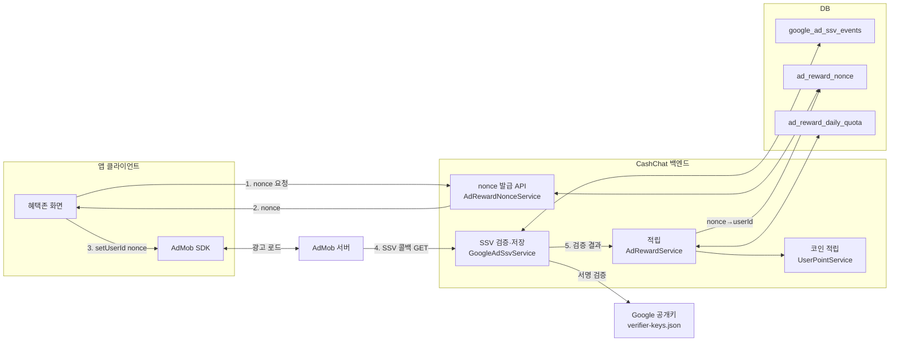

# 리워드 광고 SSV (Google AdMob) — 구조와 동작 흐름

> 성격: 아키텍처/개요 (기능이 **어떤 구조와 흐름**으로 동작하는지 설명)
> 요구사항·인수기준은 [`../reward/spec.md`](../reward/spec.md), 설계는 [`../../superpowers/specs/2026-05-31-reward-be3-ad-reward-design.md`](../../superpowers/specs/2026-05-31-reward-be3-ad-reward-design.md) 참조
> 연동·테스트·후속 작업(프론트/인프라)은 [`manual.md`](./manual.md) 참조
> Jira: CC-242(SSV 검증/로깅) · CC-288/BE-3(적립 레이어)

## 1. 개요

**리워드 광고 SSV(Server-Side Verification)** 는 사용자가 AdMob 보상형 광고를 끝까지 시청하면, **AdMob 서버가 우리 백엔드로 직접 콜백을 보내** 시청 사실을 통보하고, 백엔드가 그 콜백의 **서명을 검증**한 뒤 코인을 적립하는 채널이다. 클라이언트가 "광고를 봤다"고 주장하는 것을 믿지 않고, **Google 서명이 찍힌 서버 콜백만** 신뢰한다.

오퍼월(TNK)이 "외부 전환 확정 후 비동기 통보"인 것과 구조가 비슷하지만, 리워드 광고는 "**광고 1회 시청 → 즉시 콜백 → 즉시 적립**"이다. 다만 콜백은 AdMob 서버에서 오므로 앱 화면에는 즉시 반영되지 않고, 앱이 잔액/quota를 재조회해야 한다.

위조의 핵심 위험은 **"다른 사람의 userId로 콜백을 위조해 내 계정에 적립"** 이다. SSV의 `user_id` 필드는 클라이언트가 임의로 채울 수 있으므로, 백엔드는 이 값을 **직접 신뢰하지 않고** "서버가 광고 시청 직전 발급한 단일 사용 nonce"로만 받아 `nonce → 내부 userId`를 서버측에서 해석한다.

### 현재 구현 상태

| 영역 | 상태 | 비고 |
| ---- | ---- | ---- |
| 백엔드 — SSV 콜백 서명 검증·이벤트 저장 | ✅ **구현 완료** | `GoogleAdSsvService.verifyAndStore` |
| 백엔드 — nonce 발급·일일한도·코인 적립 | ✅ **구현 완료** | `AdRewardService.grantFromCallback`, `AdRewardNonceService` |
| 프론트엔드 — nonce를 SSV `user_id`로 전달 | ⚠️ **불일치 (수정 필요)** | 현재 클라는 nonce를 `custom_data`로 보냄 → 백엔드는 `user_id`를 읽음. [`manual.md` §2](./manual.md) 참조 |
| 프론트엔드 — `issue-nonce` 호출·quota 연동 | 🚧 **부분/계획** | 광고 시청 전 nonce 발급 흐름 정비 필요 |
| 운영 설정 — AdMob 콘솔 SSV URL 등록·광고단위 ID 주입 | 🚧 **예정** | [`manual.md` §3](./manual.md) 참조 |

> **핵심 갭**: 백엔드는 nonce를 SSV `user_id`에서 읽도록 구현됐지만, 현재 앱 클라이언트(`RewardedAdManager`)는 nonce를 `custom_data`(`setCustomData`/`customRewardText`)로 싣는다. 이 위치 불일치를 해소(클라가 `setUserId`/`userIdentifier` 사용)하기 전까지 **실제 적립은 end-to-end로 동작하지 않는다.**

## 2. 구성 요소

| 주체 | 역할 |
| ---- | ---- |
| **앱 클라이언트** (프론트엔드) | 광고 시청 직전 백엔드에서 nonce를 발급받아 AdMob SSV `user_id` 필드에 설정하고 보상형 광고를 노출한다. (현재 `custom_data`로 싣는 불일치 존재 — §1 갭) |
| **AdMob SDK / AdMob 서버** | 광고를 제공하고, 시청 완료가 확정되면 AdMob 서버 → 우리 백엔드로 SSV 콜백(GET)을 서명과 함께 전송한다. |
| **CashChat 백엔드** | nonce 발급 API, SSV 콜백 서명 검증·이벤트 저장, nonce→userId 해석·일일한도·코인 적립, quota 조회를 담당한다. |
| **Google 공개키 서버** (`gstatic.com`) | SSV 서명 검증용 ECDSA 공개키 묶음(`verifier-keys.json`)을 제공한다. 백엔드가 캐시한다. |
| **DB** | `google_ad_ssv_events`(콜백 이벤트·적립 상태), `ad_reward_nonce`(nonce↔userId), `ad_reward_daily_quota`(일일 시청 횟수). |



## 3. 동작 흐름

1. **nonce 발급** — 앱이 광고 시청 직전 `POST /api/ads/reward/issue-nonce`(JWT 인증)를 호출한다. 백엔드는 `ad_reward_nonce`에 `(nonce=UUID, userId, expiresAt=now+TTL, used=false)`를 INSERT하고 `{ nonce, expiresAt }`을 반환한다.
2. **광고 노출** — 앱이 AdMob SDK로 보상형 광고를 로드·노출하며, 받은 nonce를 SSV `user_id` 필드에 설정한다(`setUserId`/`userIdentifier`).
3. **시청 완료** — 사용자가 광고를 끝까지 본다. AdMob이 시청을 확정한다.
4. **SSV 콜백** — AdMob 서버가 `GET /api/ads/google/ssv?...&signature=...&key_id=...`로 콜백을 보낸다. 표준 파라미터: `ad_unit, reward_amount, reward_item, timestamp, transaction_id, user_id(=nonce), signature, key_id`.
5. **검증·저장** (`GoogleAdSsvService.verifyAndStore`, 무트랜잭션) — 쿼리스트링 파싱 → 광고단위 검증(설정 시) → `key_id`로 공개키 조회(캐시) → `SHA256withECDSA` 서명 검증 → `google_ad_ssv_events`에 저장(`transaction_id` 유니크로 dedup, 상태 `VERIFIED`). 결과(callback, newlyStored)를 반환한다. **이 단계는 적립하지 않는다.**
6. **적립** (`AdRewardService.grantFromCallback`, 단일 `@Transactional`) — 이벤트를 비관적 락으로 재조회 → `callback.userId`(=nonce)를 `ad_reward_nonce`에서 락 조회해 내부 `userId` 해석 → 일일 한도 확인 → `UserPointService.recordTransaction`으로 **코인(서버 고정값) 적립** → 이벤트 상태 `GRANTED`.
7. **앱 반영** — 콜백은 AdMob 서버발이라 앱에 즉시 안 뜬다. 앱은 `GET /api/ads/reward/quota`/잔액 조회로 재조회해 반영한다.

> **적립 코인**은 서버 설정값(`app.ads.reward.coin-amount`, 기본 40)을 쓴다. 콜백의 `reward_amount`(AdMob 콘솔 설정값)는 **신뢰·사용하지 않는다**(코인 이코노미는 서버 정책). 리워드 광고는 코인만 적립하며 energy·매출회계(ledger)는 적립하지 않는다(§5 참조).

### 순차 흐름도 (Sequence Diagram)

```mermaid
sequenceDiagram
    actor User as 사용자
    participant FE as 앱 클라이언트
    participant SDK as AdMob SDK
    participant AdMob as AdMob 서버
    participant API as CashChat 백엔드
    participant DB as DB

    Note over User,DB: 1단계 — nonce 발급 (동기, 광고 시청 직전)
    User->>FE: 혜택존 [지금 시청]
    FE->>API: GET /api/ads/reward/quota (잔여 확인)
    API-->>FE: { usedToday, remaining, ... }
    FE->>API: POST /api/ads/reward/issue-nonce (JWT)
    API->>DB: ad_reward_nonce INSERT (nonce, userId, expiresAt, used=false)
    API-->>FE: { nonce, expiresAt }
    FE->>SDK: setUserId(nonce) → 광고 노출
    SDK<->>AdMob: 광고 로드
    User->>SDK: 광고 끝까지 시청

    Note over User,DB: 2단계 — SSV 콜백 검증·저장 (무트랜잭션)
    AdMob->>API: GET /api/ads/google/ssv?...&signature=...&key_id=...
    API->>API: 파싱 → ad_unit 검증 → 공개키 조회(캐시) → ECDSA 서명 검증
    alt 서명 실패 / 파싱 실패
        API-->>AdMob: 400 (이벤트 미저장)
    else 공개키 일시 조회 불가
        API-->>AdMob: 503
    else 검증 성공
        API->>DB: google_ad_ssv_events UPSERT (VERIFIED, transaction_id 유니크 dedup)

        Note over API,DB: 3단계 — 적립 (단일 @Transactional, 락 순서 event→nonce→quota→point)
        API->>DB: event 락 조회 (VERIFIED 인 것만 적립 시도)
        API->>DB: ad_reward_nonce 락 조회 (user_id=nonce)
        alt nonce 없음 / 만료 / 이미 used
            API->>DB: event status=REJECTED_INVALID_NONCE
            API-->>AdMob: 200 (재시도 폭주 방지)
        else nonce 유효
            API->>DB: ad_reward_daily_quota 락 조회/생성
            alt usedCount >= dailyLimit
                API->>DB: nonce.used=true; event status=REJECTED_OVER_QUOTA
                API-->>AdMob: 200
            else 한도 내
                API->>DB: quota.usedCount += 1; nonce.used=true
                API->>API: recordTransaction(userId, 코인, key="admob:reward:{transactionId}")
                API->>DB: event status=GRANTED
                API-->>AdMob: 200
            end
        end
    end

    Note over User,DB: 4단계 — 앱 반영 (별도 조회)
    User->>FE: 광고 종료 / 화면 복귀
    FE->>API: GET /api/ads/reward/quota · 잔액 조회
    API-->>FE: 갱신된 quota / 잔액
```

## 4. 컴포넌트 & 데이터

**웹 (`domain/ad/web/`)**
- `GoogleAdSsvController` — `GET /api/ads/google/ssv` (public). `verifyAndStore` → 검증 성공이면 `grantFromCallback` 호출 후 200.
- `AdRewardController` — `POST /api/ads/reward/issue-nonce`(auth), `GET /api/ads/reward/quota`(auth).
- `GoogleAdSsvExceptionHandler` — `InvalidGoogleAdSsvCallbackException → 400`, `GoogleAdSsvTransientException → 503`.

**서비스 (`domain/ad/service/`)**
- `GoogleAdSsvQueryParser` — 쿼리스트링 파싱. `signature`·`key_id`가 **마지막 두 파라미터**여야 하고(서명 대상 페이로드 = `&signature=` 앞부분), 중복 키·잘못된 percent 인코딩을 거절.
- `GoogleAdPublicKeyClient` — `verifier-keys.json`에서 `key_id → EC 공개키` 로드, TTL 캐시. 조회 실패는 `GoogleAdSsvTransientException`(503).
- `GoogleAdSsvSignatureVerifier` — `SHA256withECDSA`, 서명은 Base64 URL 디코딩.
- `GoogleAdSsvService` — 검증 + `google_ad_ssv_events` 멱등 저장. **적립 안 함.**
- `AdRewardNonceService` — `issueFor(userId)`: UUID nonce + TTL 저장.
- `AdRewardService` — `grantFromCallback`(적립), `quotaOf`(조회).

**테이블**
- `google_ad_ssv_events` (V4): `transaction_id`(UNIQUE), `user_id`(=nonce, VARCHAR(128)), `reward_amount`, `reward_item`, `ad_unit`, `key_id`, `reward_status`, `raw_query_string`.
- `ad_reward_nonce` (V5): `nonce`(PK, VARCHAR(64)), `user_id`(FK→users), `expires_at`, `used`.
- `ad_reward_daily_quota` (V5): `(user_id, kst_date)`(PK), `used_count`.

**`reward_status` 전이**: `VERIFIED`(초기 저장) → `GRANTED` / `REJECTED_INVALID_NONCE` / `REJECTED_OVER_QUOTA`.

## 5. 보안·정합성 설계

콜백 엔드포인트는 인증 없는 public(AdMob 서버가 호출)이므로 위조·중복·동시성을 다음으로 방어한다.

- **서명 검증 우선** — `key_id`로 받은 Google 공개키로 `SHA256withECDSA` 서명을 검증한다. 서명 페이로드는 `signature` 앞까지의 원본 쿼리스트링이라, 파서는 `signature`·`key_id`를 **마지막 두 파라미터로 강제**한다. 서명 실패 시 400 + 이벤트 미저장.
- **nonce 신뢰 모델** — SSV `user_id`는 클라가 임의로 채우는 값이므로 직접 신뢰하지 않는다. 광고 시청 직전 서버가 발급한 **단일 사용·단기 TTL nonce**만 받아 `nonce → 내부 userId`를 서버측에서 해석한다. 위조된 `user_id`로 타인 계정에 적립되는 것을 막는다.
- **멱등성 (이중 방어선)** — ① `google_ad_ssv_events.transaction_id` UNIQUE로 동일 콜백 dedup, ② 적립 멱등키 `admob:reward:{transactionId}`. AdMob 재전송에도 1회만 적립.
- **동시성 / 락 순서** — 데드락 방지를 위해 **event → nonce → ad_reward_daily_quota → user_point** 순으로 비관적 쓰기 락을 획득한다. 동일 transactionId 동시 콜백의 상태 덮어쓰기(GRANTED→REJECTED)와, 동일 nonce 동시 요청의 중복 적립(TOCTOU)을 막는다.
- **단일 사용 nonce** — 적립 성공 시 `used=true`. 한도 초과로 거절돼도 유효 nonce는 1회 시청에 소모된 것으로 보고 `used=true` 처리(재사용 차단). nonce 없음/만료/used → `REJECTED_INVALID_NONCE`.
- **재시도 폭주 방지** — 서명만 통과했다면(거절 케이스 포함) AdMob에 **200**을 반환한다. 적립 실패(예: DB 예외)도 SSV 엔드포인트가 5xx를 던지지 않게 설계해 AdMob의 무한 재전송을 막는다. 단, **서명 실패는 400**, 공개키 일시 불가는 **503**.
- **광고단위 검증(선택)** — `app.ads.google.rewarded-ad-unit-ids`(콤마 구분, Android·iOS)가 설정되면 콜백 `ad_unit`이 목록 중 하나와 일치해야 적립된다(불일치 시 200이되 미적립). 빈 값이면 검증을 건너뛴다.

## 6. 설계 이력 — 적립 경로 정리 (중요)

초기에 **두 개의 적립 경로**가 같은 콜백에 얽혀 있었다:

1. **코인 경로** (CC-288/BE-3, nonce 기반) — `AdRewardService.grantFromCallback` → 코인 40 고정.
2. **ledger 경로** (cc-311 통합회계, 후행 추가) — `GoogleAdSsvService`가 `LedgerService.recordRevenue` 호출 → `reward_amount` 기반 cashablePt+energy 분배. 이 경로가 `user_id`를 **숫자 내부 id로 강제**(`toLongOrNull`)해, nonce(비숫자)·테스트용 이메일에서 **400**을 유발했다.

**결정**: 적립 정본을 **코인 경로(nonce)** 로 통일. `GoogleAdSsvService`에서 숫자 강제와 ledger 적립을 제거(검증+저장만 담당). `LedgerService`와 `app.ledger.rewards`의 `AD` 설정은 **휴면 상태**로 남는다(호출자 없음 — 삭제는 별도 과제). 그 결과 리워드 광고는 **코인만** 적립하고 energy·매출회계는 적립하지 않는다.

## 7. 범위 외 & 후속 과제

- **프론트엔드 통합** — nonce를 `custom_data`가 아니라 SSV `user_id`로 전달하도록 수정(§1 갭), `issue-nonce` 선행 호출·quota 연동·시청 후 잔액/quota 재조회. 상세 지침은 [`manual.md`](./manual.md).
- **운영 설정** — AdMob 콘솔 SSV 콜백 URL 등록, 보상형 광고단위 ID 주입, 공개키 URI 확인. [`manual.md`](./manual.md).
- **휴면 코드 정리** — `LedgerService`/`app.ledger.rewards.AD`가 ad 경로에서 더 이상 쓰이지 않음. 타 수익원에서 ledger를 쓸 계획이 없으면 제거 검토.
- **energy 적립 여부 재확인** — 현재 리워드 광고는 코인만 적립. energy도 줄 정책이면 별도 설계 필요.
- **코인 동적 조정·환수(revoke)** — 범위 외.

## 8. 참고

- 설계: [`../../superpowers/specs/2026-05-31-reward-be3-ad-reward-design.md`](../../superpowers/specs/2026-05-31-reward-be3-ad-reward-design.md), [`../../superpowers/specs/2026-05-17-google-admob-ssv-backend-design.md`](../../superpowers/specs/2026-05-17-google-admob-ssv-backend-design.md)
- 요구사항: [`../reward/spec.md`](../reward/spec.md)
- 연동·테스트·후속작업: [`manual.md`](./manual.md)
- Google SSV 문서: https://developers.google.com/admob/android/ssv · https://developers.google.com/admob/ios/ssv
- 공개키: https://www.gstatic.com/admob/reward/verifier-keys.json
