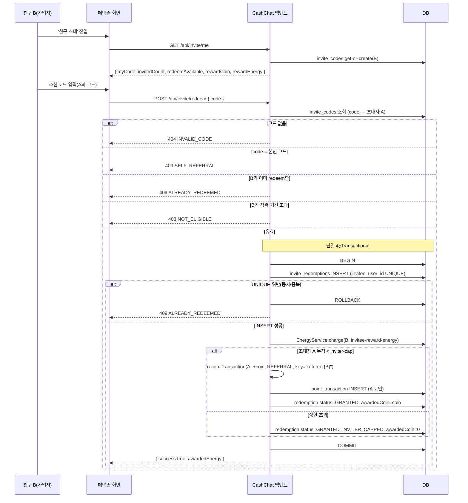

# 혜택존(Invite) — 친구 초대(추천 코드) 백엔드 기술 설계

> 상태: Draft
> 범위: 백엔드 (`domain/invite/` 추천 코드 적립 채널)
> 관련 기획: [Confluence — 혜택존 TNK 오퍼월·출석·부가 위젯](https://moneyfactoryslave.atlassian.net/wiki/spaces/FCTC/pages/14909530/TNK), `docs/superpowers/specs/2026-06-21-benefit-zone-friend-invite-design.md`(FE 설계), `docs/planning/be-api-requests-cc355.md` §5(FE→BE API 요청)
> 선행 인프라: `domain/point/UserPointService.recordTransaction(idempotencyKey)`(코인 멱등 적립), `domain/energy/EnergyService.charge`(에너지 충전)
> Jira: CC-355 §H

## 목표 (Goal)

혜택존에 **추천 코드** 기반 친구 초대 적립 채널을 백엔드로 추가한다. 사용자가 친구의 추천 코드를 혜택존 '친구 초대' 화면에서 입력(redeem)하면, 백엔드는 코드를 검증하고 다음을 **단일 트랜잭션**으로 수행한다.

1. **코드 발급**: 각 사용자에게 고유 추천 코드를 부여한다. `GET /api/invite/me` 최초 호출 시 get-or-create(멱등)로 생성한다.
2. **redeem 검증·지급**: 코드 유효성·자기코드 금지·1인 1회·적격 기간을 검증한 뒤, **가입자(입력자)에게 에너지**를, **초대자(코드 소유자)에게 코인**을 지급한다.
3. **원장 기록**: 모든 성공 redeem을 `invite_redemptions`에 1행으로 기록한다(누가 누구를 초대했는지, 지급 결과 포함).

코인 적립은 기존 `UserPointService.recordTransaction(idempotencyKey)`의 멱등성 트랜잭션을 통해 수행하며, 사유로 `REFERRAL`을 추가한다. 에너지 충전은 `EnergyService.charge(userId, amount)`를 사용한다 — 이 메서드는 멱등성 키가 없으므로, **에너지 중복 지급 방어는 `invite_redemptions.invitee_user_id` UNIQUE 제약**이 1차 방어선이 된다.

## 핵심 설계 결정 (Decisions)

| # | 결정 | 내용 |
| - | ---- | ---- |
| D1 | 식별 방식 | 사용자당 고유 **추천 코드**(길이 `code-length`, 기본 6자, 혼동 문자 `O/0/I/1/L` 제외한 대문자+숫자). `GET /api/invite/me` 최초 호출 시 **get-or-create**(멱등). 딥링크/초대 링크는 미사용(범위 외). |
| D2 | redeem 적격 | redeem 가능 조건은 **(a) 본인이 아직 추천 코드를 입력한 적이 없음** AND **(b) 가입 후 `redeem-window-days`일(KST 기준) 이내**. 둘 다 충족 시 `GET /api/invite/me`의 `redeemAvailable=true`. |
| D3 | 초대자 보상 상한 | 초대자(코드 소유자)의 코인 보상은 **최대 `inviter-cap`명**까지만 지급한다. 상한 도달 이후 친구가 redeem하면 **친구 에너지는 정상 지급하되 초대자 코인은 지급하지 않는다** — 친구의 가입 보상은 초대자의 인기와 독립적이어야 하기 때문이다. |
| D4 | 멱등·원자성 | redeem은 **단일 `@Transactional`**. `invite_redemptions.invitee_user_id` **UNIQUE** 제약이 "1인 1회 + 에너지 중복 지급"의 1차 방어선이다(동시 redeem 2건 중 1건만 INSERT 성공). 초대자 코인은 멱등성 키 `referral:{inviteeUserId}`로 이중 방어한다. |
| D5 | 어뷰징 방지 | 디바이스 핑거프린팅/IP 기반 다계정 차단은 **이번 범위 외**(후속 phase). 자기 코드 금지·1인 1회·적격 기간·코드 유효성만 검증한다. |
| D6 | 보상값 출처 | `rewardCoin`(초대자 코인)·`rewardEnergy`(가입자 에너지)·`redeem-window-days`·`inviter-cap`은 전부 **서버 설정값**(`app.invite.*`). FE는 표시·입력만 한다. |

## 유저 스토리 · 인수 조건

> 이 기능의 **유저 스토리와 관찰 가능한 인수 조건(검증 기준선)** 은 도메인 카탈로그가 단일 소유한다(SSOT): [US-REWARD-004 친구 초대(추천 코드)](../../domains/reward/US-REWARD-004-friend-invite.md).
> 본 문서는 그 계약을 만족시키는 **백엔드 구현 상세**(설계 결정·API·데이터 모델·트랜잭션 불변식·시퀀스)를 담는다.

## 구현 불변식 (Design Invariants)

관찰 가능한 AC는 위 US 파일이 소유하고, 아래는 그것을 보장하는 백엔드 구현 규칙이다(핵심 설계 결정은 위 표 참조).

- **코드 발급**은 get-or-create(멱등). `invite_codes(user_id PK, code UNIQUE)` — 혼동 문자 제외 난수, UNIQUE 충돌 시 재생성, 동시 최초 호출도 하나만 생성.
- **redeem은 단일 `@Transactional`** — `invite_redemptions` INSERT → `EnergyService.charge(B)` → (상한 내면) `recordTransaction(A, REFERRAL, "referral:{B}")` → redemption 확정. 한 단계 실패 시 전체 롤백.
- **1인 1회 + 에너지 중복 방어의 1차 방어선은 `invite_redemptions.invitee_user_id` UNIQUE** (`EnergyService.charge`는 멱등 키가 없기 때문). 초대자 코인은 멱등키 `referral:{inviteeUserId}`로 이중 방어. 동시 redeem 2건 중 1건만 INSERT 성공.
- **거절 분기**: 이미 입력 → `409 ALREADY_REDEEMED`, 자기 코드 → `409 SELF_REFERRAL`, 미존재 코드 → `404 INVALID_CODE`, 적격 기간 초과 → `403 NOT_ELIGIBLE`(`redeemAvailable=false`와 일관).
- **초대자 상한**(`inviter-cap`) 초과 시 redemption을 `GRANTED_INVITER_CAPPED`, `awardedCoin=0`으로 기록하고 **B 에너지는 정상 충전**, A 코인 미지급 — 친구의 가입 보상은 초대자 인기와 독립.
- 보상값·상한·적격 기간은 전부 서버 설정값(`app.invite.*`). 딥링크·어뷰징 차단은 범위 외.

## API 계약 (요약)

| Method | Path | 인증 | 설명 |
| ------ | ---- | ---- | ---- |
| `GET` | `/api/invite/me` | 사용자 | 내 추천 코드(get-or-create)·초대 성공 수·redeem 가능 여부·보상 표시값 |
| `POST` | `/api/invite/redeem` | 사용자 | 바디 `{ code }`. 코드 검증 후 친구 에너지 + 초대자 코인 지급 |

### `GET /api/invite/me` 응답 (200)

```json
{
  "myCode": "ABC23X",
  "invitedCount": 3,
  "redeemAvailable": true,
  "rewardCoin": 500,
  "rewardEnergy": 10
}
```

| 필드 | 타입 | 설명 |
| ---- | ---- | ---- |
| `myCode` | String | 내 추천 코드(공유용, get-or-create) |
| `invitedCount` | Int | 내 코드로 redeem한 친구 수 |
| `redeemAvailable` | Boolean | 내가 추천 코드를 입력할 수 있는지(미사용 AND 적격 기간 내) |
| `rewardCoin` | Int | 초대 성공 시 초대자 코인(표시용, 서버 설정값) |
| `rewardEnergy` | Int | 추천 코드 입력 시 가입자 에너지(표시용, 서버 설정값) |

### `POST /api/invite/redeem` 요청·응답

```json
// 요청
{ "code": "XYZ29K" }

// 응답 (200)
{ "success": true, "awardedEnergy": 10, "message": null }
```

| 필드 | 타입 | 설명 |
| ---- | ---- | ---- |
| `success` | Boolean | 적립 성공 여부 |
| `awardedEnergy` | Int | 입력자(가입자)에게 지급된 에너지 |
| `message` | String? | 실패 사유(표시용, 성공 시 null) |

에러:

| HTTP | 코드 | 사유 |
| ---- | ---- | ---- |
| 409 | `ALREADY_REDEEMED` | 이미 추천 코드를 사용함 |
| 404 | `INVALID_CODE` | 존재하지 않는 코드 |
| 409 | `SELF_REFERRAL` | 자기 코드 입력 |
| 403 | `NOT_ELIGIBLE` | 적격 아님(가입 후 기간 초과) |

## 사용자 흐름 (User Flow)

1. 사용자가 혜택존 '친구 초대' 화면에 진입한다.
2. 프론트가 `GET /api/invite/me`로 내 코드·초대 수·redeem 가능 여부·보상값을 조회한다(최초 호출 시 코드 생성).
3. (공유) 사용자가 OS 공유시트로 코드를 친구에게 공유한다(FE 책임).
4. (입력) 친구가 자신의 혜택존 '친구 초대' 화면에서 받은 코드를 입력하고 `POST /api/invite/redeem`을 호출한다.
5. 백엔드가 코드·자기참조·1인1회·적격을 검증하고, 단일 트랜잭션으로 친구 에너지와 (상한 내라면) 초대자 코인을 지급한 뒤 redemption을 기록한다.
6. 프론트가 적립 결과 토스트를 표시하고 `GET /api/invite/me`를 재조회한다.

### 순차 흐름도 (Sequence Diagram)



## 데이터 모델 (Flyway V13)

### `invite_codes`

| 컬럼 | 타입 | 비고 |
| ---- | ---- | ---- |
| `user_id` | BIGINT | PK, 사용자당 1행 |
| `code` | VARCHAR | UNIQUE, 혼동 문자 제외 대문자+숫자 |
| `created_at` / `updated_at` | (BaseEntity) | |

### `invite_redemptions` (원장)

| 컬럼 | 타입 | 비고 |
| ---- | ---- | ---- |
| `id` | BIGINT | PK |
| `invitee_user_id` | BIGINT | **UNIQUE** (1인 1회 + 에너지 중복 지급 방어) |
| `inviter_user_id` | BIGINT | 코드 소유자(초대자) |
| `code` | VARCHAR | 입력된 코드 원본 |
| `awarded_energy` | INT | 가입자에게 지급한 에너지 |
| `awarded_coin` | BIGINT | 초대자에게 지급한 코인(상한 초과 시 0) |
| `status` | ENUM | `GRANTED` / `GRANTED_INVITER_CAPPED` |
| `created_at` / `updated_at` | (BaseEntity) | |

- `inviter_user_id`에 인덱스(초대자별 누적 카운트 / `invitedCount` 조회용).
- `invitee_user_id` UNIQUE는 멱등성 없는 `EnergyService.charge`의 중복 지급을 막는 핵심 제약이다.

## 설정 (`app.invite.*`)

| 키 | 기본값(예시) | 설명 |
| -- | ------ | ---- |
| `code-length` | `6` | 추천 코드 길이 |
| `inviter-reward-coin` | `500` | 초대 성공 시 초대자 코인 |
| `invitee-reward-energy` | `10` | 코드 입력 시 가입자 에너지 |
| `redeem-window-days` | `7` | 가입 후 redeem 적격 기간(일, KST) |
| `inviter-cap` | `20` | 초대자가 코인 보상받을 수 있는 최대 초대 성공 수 |

> 코드 문자 집합은 혼동 방지를 위해 `O/0/I/1/L`을 제외한다(예: `ABCDEFGHJKMNPQRSTUVWXYZ23456789`).

## 검증 필요 항목

- [ ] `PointTransactionReason`에 `REFERRAL` enum 추가 — 적립 사유 분류.
- [ ] 보상값(`inviter-reward-coin`, `invitee-reward-energy`)·상한(`inviter-cap`)·적격 기간(`redeem-window-days`) 운영 확정값은 기획/운영과 협의 후 `application.yml`에 주입.
- [ ] `invitedCount` 정의 확정 — 본 spec은 "내 코드로 redeem한 친구 수(상한 초과분 포함)". 상한 초과분 표시 정책은 FE와 동기화.

## 범위 외 (Out Of Scope)

- 딥링크/초대 링크 기반 초대 — 추천 코드 입력만(추후 별도).
- 디바이스 핑거프린팅/IP 기반 다계정 어뷰징 차단 — 후속 phase (D5).
- 온보딩/가입 단계에서의 코드 입력 — 가입 후 혜택존에서만 redeem.
- 적립 후 환수(claw-back)/운영자 수동 조정.
- 초대 보상 동적 환산·관리자 UI.
- 프론트엔드(KMM `shared/`, Android/iOS) 구현 — `2026-06-21-benefit-zone-friend-invite-design.md` 참조.
