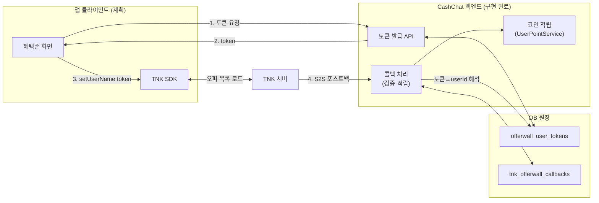
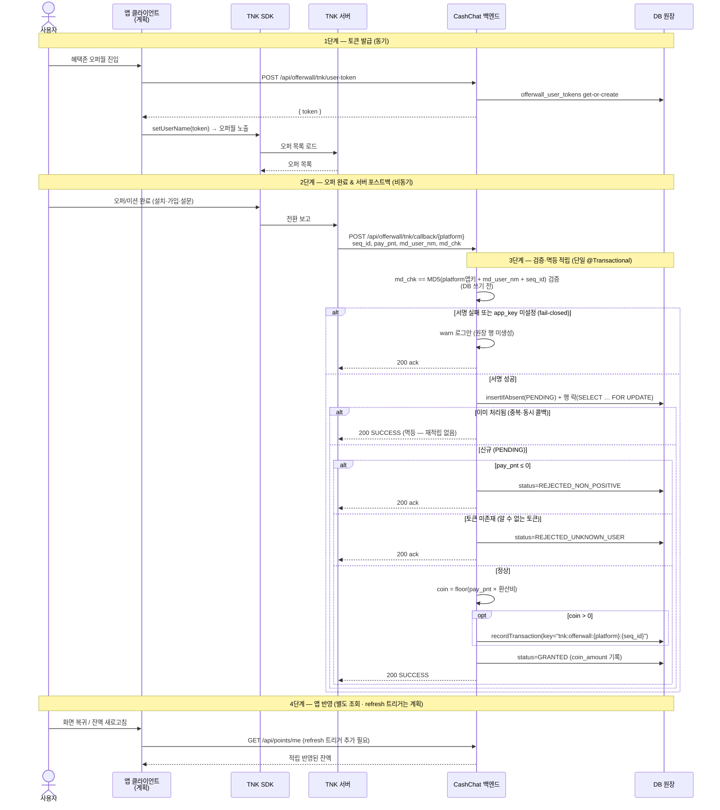

# 혜택존 TNK 오퍼월 — 구조와 동작 흐름

> 성격: 아키텍처/개요 (기능이 **어떤 구조와 흐름**으로 동작하는지 설명)
> 요구사항·인수기준은 [`spec.md`](./spec.md) 참조
> Jira: CC-288 · 관련: [Confluence — 혜택존 TNK 오퍼월](https://moneyfactoryslave.atlassian.net/wiki/spaces/FCTC/pages/14909530)

## 1. 개요

**오퍼월(Offerwall)** 은 사용자가 외부 광고주의 미션(앱 설치·회원가입·설문 등)을 완료하면 그 보상을 코인으로 적립해 주는 적립형 광고 채널이다. 혜택존에 **TNK Factory 오퍼월**을 연동해, 사용자가 TNK 오퍼를 완료하면 TNK가 우리 백엔드로 적립을 통보(서버 포스트백)하고 백엔드가 이를 검증해 코인을 적립한다.

리워드 광고(AdMob)가 "광고 시청 1회 → 즉시 적립"인 것과 달리, 오퍼월은 **외부 전환이 확정된 뒤 TNK 서버가 비동기로 통보**하는 구조다. 따라서 적립은 콜백 수신 시점에 일어나며, 앱 화면에는 즉시 반영되지 않는다.

### 현재 구현 상태

| 영역 | 상태 | 비고 |
| ---- | ---- | ---- |
| 백엔드 (토큰 발급 API · 콜백 검증·적립 · DB 원장) | ✅ **구현 완료** | Android/iOS 플랫폼 분리(CC-361) 반영 |
| 프론트엔드 (앱 클라이언트 TNK SDK 연동) | 🚧 **계획** | `setUserName` 설정·오퍼월 노출 미구현 |
| 운영 설정 (콜백 URL 등록 · `app-key` 시크릿 주입) | 🚧 **예정** | Android/iOS 앱별 콜백 URL·앱키를 각각 TNK 콘솔에 등록 (CC-361) |

> **플랫폼 분리(CC-361)**: TNK는 Android/iOS를 별도 앱으로 등록해 앱키·콜백 URL이 플랫폼마다 다르다. 콜백 경로 `/api/offerwall/tnk/callback/{platform}`(`android`/`ios`)로 플랫폼을 식별하고, 해당 플랫폼 앱키로 `md_chk`를 검증한다. 멱등성·원장 단위는 `(platform, seq_id)`로, 콜백 포스트백 페이로드 자체는 양 플랫폼이 동일하다(TNK 규격).

> 이 문서에서 **(계획)** 으로 표기된 부분은 아직 구현되지 않은 프론트엔드 동작을 흐름 이해를 위해 추상적으로 기술한 것이다.

## 2. 구성 요소

오퍼월은 세 주체와 백엔드의 데이터 원장으로 이루어진다.

| 주체 | 역할 |
| ---- | ---- |
| **앱 클라이언트** (프론트엔드, *계획*) | 백엔드에서 오퍼월 사용자 토큰을 발급받아 TNK SDK `setUserName`에 설정하고 오퍼월 화면을 노출한다. 사용자가 오퍼/미션을 완료한다. |
| **CashChat 백엔드** | 토큰 발급 API 제공, TNK 포스트백(S2S 콜백) 검증·처리, 코인 적립, 콜백 원장 기록을 담당한다. |
| **TNK 오퍼월** | 오퍼 목록을 클라이언트 SDK로 직접 제공하고, 전환이 확정되면 우리 백엔드 콜백으로 서버 포스트백을 전송한다. |
| **DB 원장** | `offerwall_user_tokens`(토큰↔사용자 매핑)와 `tnk_offerwall_callbacks`(**서명 통과** 콜백 기록 — 서명 실패는 원장에 남기지 않고 로그만)을 보관한다. |

## 3. 동작 흐름

1. **토큰 발급** — 앱이 백엔드에서 오퍼월 사용자 토큰을 발급받는다. 사용자당 안정적이고 불투명한 토큰을 get-or-create로 1개 받는다(내부 `userId` 비노출).
2. **SDK 초기화** *(계획)* — 앱이 TNK SDK를 초기화할 때 이 토큰을 `userName`으로 설정하고 오퍼월 화면을 띄운다.
3. **오퍼 완료** — 사용자가 미션/광고를 완료한다(앱 설치·가입·설문 등).
4. **서버 포스트백** — TNK가 전환을 확인하면 TNK 서버 → 백엔드로 S2S 포스트백(콜백)을 전송한다.
5. **검증·적립** — 백엔드가 `md_chk` 서명을 검증하고 → 토큰으로 사용자를 식별한 뒤 → `pay_pnt × 환산비`를 코인으로 멱등 적립하고 → 원장에 기록한 다음 200 ack를 반환한다.
6. **앱 반영** — 콜백은 비동기이므로 적립이 즉시 화면에 뜨지 않는다. 앱은 잔액 조회 API `GET /api/points/me`로 새로고침해 반영한다. BE 엔드포인트와 프론트 `RemotePointsRepository.refresh()`(API 호출)는 **구현돼 있으나, 현재 이 `refresh()`를 호출하는 FE 트리거가 없다**(화면들은 `balance`를 구독만 함). 따라서 오퍼월 복귀 시 새 적립을 가져오려면 **복귀/on-resume 시점에 `refresh()`를 호출하는 트리거 추가가 (계획) FE 통합 항목으로 필요**하다.

### 순차 흐름도 (Sequence Diagram)

## 4. 보안·정합성 설계

콜백 엔드포인트는 인증이 없는 public 엔드포인트(TNK 서버가 호출)이므로, 위조·중복·이상치 콜백을 다음 원칙으로 방어한다.

- **서명 검증 우선** — `md_chk = MD5(app_key + md_user_nm + seq_id)`. **DB 쓰기보다 먼저** 검증해 미검증 요청이 원장을 오염시키지 못하게 한다. 실패 시 `warn` 로그만 남기고 미기록(AdMob SSV 패턴과 정합). 콜백 경로 `{platform}`로 어느 앱키를 쓸지 확정되며, `app_key`는 플랫폼별 공유 시크릿이라 이를 모르면 토큰·`seq_id`를 위조해도 유효한 `md_chk`를 만들 수 없다. (해시 알고리즘 MD5는 **TNK 규격상 고정값**으로 우리가 선택·교체할 수 없다. 위조 방어력은 MD5 강도가 아니라 `app_key` 비밀성에 의존하므로, app_key 노출 시 즉시 재발급이 핵심이다.)
- **fail-closed** — 해당 플랫폼 `app_key`가 미설정(빈 값)이면 그 플랫폼 콜백을 모두 거절한다(앱 자체는 정상 부팅). 시크릿 누락이 fail-open(전량 통과)으로 이어지지 않게 한다.
- **멱등성 (이중 방어선)** — `(platform, seq_id)`당 1행(복합 `UNIQUE`) + 행 락(`insertIfAbsent` + `SELECT … FOR UPDATE`)으로 동일 `(platform, seq_id)` 동시·중복 콜백을 직렬화하고, PENDING 1건만 적립한다. 추가로 적립 단계에 멱등키 `tnk:offerwall:{platform}:{seq_id}`를 적용해 설령 같은 키가 두 번 도달해도 1회만 적립된다. (같은 `seq_id`라도 플랫폼이 다르면 독립 콜백으로 처리한다.) `insertIfAbsent`는 `ON DUPLICATE KEY` no-op이라 **예외를 던지지 않으므로**(상위 트랜잭션 rollback-only 방지용 의도적 설계) 삽입 성공만으로는 소유권이 정해지지 않는다 — 그래서 직렬화에 행 락이 필요하다(unique 위반 예외 캐치 방식을 의도적으로 피함).
- **불투명 토큰** — TNK에는 내부 `userId`가 아닌 UUID 토큰을 전달하고, `offerwall_user_tokens`로 `token → userId`를 해석한다. 식별자 유출·역추적을 방지한다.
- **이상치 방어** — `pay_pnt ≤ 0`는 적립하지 않고 거절 기록한다(음수가 차감으로 처리돼 포인트가 사라지는 사고 방지). 환산은 `BigDecimal` + `RoundingMode.FLOOR`로 계산해 부동소수 정밀도 손실을 막고, 0코인이면 불필요한 0원 트랜잭션을 생략한다.

> 적립액(`pay_pnt`)은 `md_chk` 해시에 포함되지 않는다(TNK 표준 설계). 따라서 적립액 무결성은 `app_key` 비밀성과 TNK S2S 채널 신뢰에 의존한다.

## 5. 범위 외 & 후속 과제

- **프론트엔드 통합** — KMM `shared/` 및 Android/iOS TNK SDK 연동, 오퍼월 화면 (계획).
- **잔액 새로고침 트리거** — `GET /api/points/me`와 `RemotePointsRepository.refresh()`는 구현됐으나 호출 지점이 없다. 오퍼월 복귀/on-resume 시 `refresh()`를 호출하는 트리거 추가가 필요(현재 화면들은 잔액 구독만).
- **운영 설정** — Android/iOS 앱별 콜백 URL(`/api/offerwall/tnk/callback/android`·`/ios`) 등록, TNK 콘솔에서 플랫폼별 `app-key` 발급 후 시크릿(`APP_OFFERWALL_TNK_ANDROID_APP_KEY`·`APP_OFFERWALL_TNK_IOS_APP_KEY`) 주입.
- **자동 취소/환수(claw-back)** — 현재는 서명 통과 콜백을 원장에 기록만 하고 자동 차감은 하지 않는다. 원장 `status`는 향후 `CANCELED` 등으로 확장 가능.
- **감사 강화** — TNK가 함께 보내는 `actn_id`·`app_nm` 등 부가 파라미터를 원장에 추가 기록(현재는 필수 4개만 사용).
- **추가 오퍼월**(Buzzvil, AdiSON 등) 연동.

## 6. 참고

- 요구사항·인수기준·검증항목: [`spec.md`](./spec.md), 작업 목록: [`tasks.md`](./tasks.md)
- Jira: **CC-288**
- Confluence: [혜택존 TNK 오퍼월](https://moneyfactoryslave.atlassian.net/wiki/spaces/FCTC/pages/14909530) · [overview](https://moneyfactoryslave.atlassian.net/wiki/spaces/FCTC/pages/14975052)
- TNK SDK: [tnk_sdk_rwd_br (Android)](https://github.com/tnkfactory/tnk_sdk_rwd_br) · [ios-sdk-rwd2 (iOS)](https://github.com/tnkfactory/ios-sdk-rwd2)
