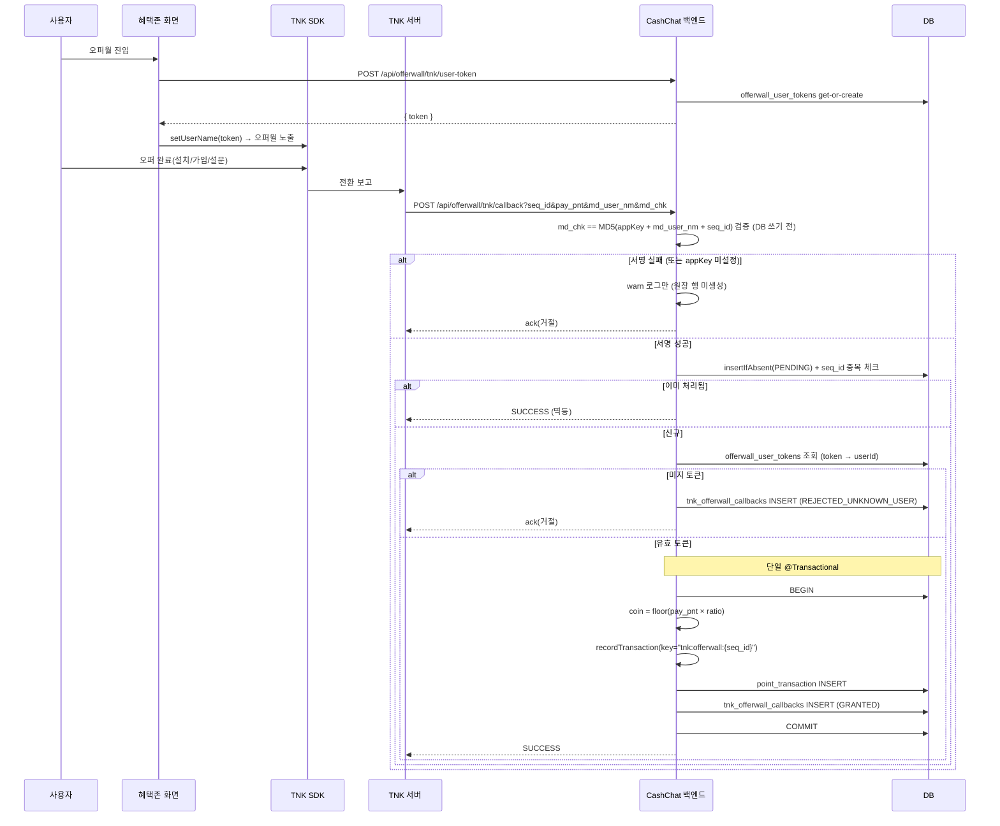

# 혜택존(Offerwall) — TNK Factory 오퍼월 백엔드 Spec

> 상태: Draft
> 범위: 백엔드 (TNK 오퍼월 적립 채널)
> 관련 기획: [Confluence — 혜택존 TNK 오퍼월](https://moneyfactoryslave.atlassian.net/wiki/spaces/FCTC/pages/14909530), [Confluence — overview](https://moneyfactoryslave.atlassian.net/wiki/spaces/FCTC/pages/14975052), `docs/features/reward/spec.md`(선행 Phase 1)
> 관련 SDK: [tnk_sdk_rwd_br (Android)](https://github.com/tnkfactory/tnk_sdk_rwd_br), [ios-sdk-rwd2 (iOS)](https://github.com/tnkfactory/ios-sdk-rwd2)
> Jira: CC-288

## 목표 (Goal)

혜택존에 **TNK Factory 오퍼월** 적립 채널을 백엔드로 추가한다. 사용자가 TNK 오퍼(앱 설치·가입·설문 등)를 완료하면 TNK 서버가 우리 백엔드 콜백(서버 포스트백/S2S)으로 적립을 통보하고, 백엔드는 다음을 수행한다.

1. **사용자 토큰 발급**: 프론트가 TNK SDK `setUserName(token)`에 넣을 불투명 토큰을 사용자당 1개 발급·해석한다 (내부 `userId` 비노출).
2. **포스트백 검증 적립**: TNK 콜백의 `md_chk` 해시를 검증하고, 토큰으로 `userId`를 해석한 뒤, 설정된 환산비로 `pay_pnt`를 코인으로 환산해 멱등 적립한다.
3. **콜백 원장 기록**: 수신한 모든 콜백을 결과 상태와 함께 `tnk_offerwall_callbacks`에 기록한다 (취소/환수 수동 정산 및 향후 자동화 대비).

적립은 기존 `domain/point/UserPointService.recordTransaction(idempotencyKey)`의 멱등성 트랜잭션을 통해 수행한다. 구조는 기존 `domain/ad`(Google AdMob SSV 리워드)의 콜백·멱등 적립 패턴을 준용한다.

## 핵심 설계 결정 (Decisions)

| # | 결정 | 내용 |
| - | ---- | ---- |
| D1 | 사용자 식별값 | TNK `setUserName`에는 **불투명 토큰(UUID)** 을 전달한다. 내부 `userId`를 직접 노출하지 않으며, `offerwall_user_tokens` 매핑 테이블로 `token → userId`를 해석한다. |
| D2 | 코인 환산 | `pay_pnt`(TNK 포인트) → 코인은 **설정 가능한 환산비** `app.offerwall.tnk.point-to-coin-ratio`(기본 `1.0`)를 곱해 산출한다. |
| D3 | 취소/환수 | **이번 범위 외**. 모든 콜백을 ledger에 기록하되 자동 차감은 하지 않는다. ledger `status`는 향후 `CANCELED` 등으로 확장 가능하게 설계한다. |
| D4 | 토큰 API | `POST /api/offerwall/tnk/user-token` — get-or-create(멱등). |
| D5 | ACK 형식 | TNK가 기대하는 정확한 ack 본문/HTTP 메서드가 SDK 문서에 미명시 → **합리적 기본값(HTTP 200 + `SUCCESS` 본문)으로 구현하고 ack 문자열을 상수로 분리**, 정확한 규격은 TNK 확인 후 조정(아래 "검증 필요 항목"). |

## 유저 스토리 (User Story)

### Story 1: 오퍼월 토큰 발급

프론트는 혜택존의 TNK 오퍼월 진입 시, TNK SDK에 넘길 안정적 사용자 식별 토큰을 서버에서 받고 싶다. 같은 사용자는 항상 같은 토큰을 받아야 한다.

### Story 2: 오퍼 완료 적립

사용자가 TNK 오퍼를 완료하면, TNK 서버가 백엔드로 포스트백을 보내고 백엔드는 검증 후 오퍼별 보상 코인을 적립한다.

### Story 3: 적립 무결성 (위조·중복 방어)

백엔드는 다음을 만족해야 한다.

1. `md_chk` 서명이 `appKey`(공유 시크릿)로 검증되지 않은 콜백은 적립하지 않는다 — `md_user_nm`(토큰)을 위조해도 `appKey`를 모르면 유효한 `md_chk`를 만들 수 없다.
2. 동일 `seq_id` 콜백이 재전송되거나 동시에 도착해도 코인을 중복 적립하지 않는다.

### Story 4: 운영 가시성

운영자는 수신된 모든 TNK 콜백(성공·거절)을 원장에서 조회해 정산·디버깅·향후 환수 처리에 활용하고 싶다.

## 인수 기준 (Acceptance Criteria)

### 토큰 발급 (최초)

Given 인증된 사용자가 오퍼월 토큰을 발급받은 적이 없다
When 사용자가 `POST /api/offerwall/tnk/user-token`을 호출한다
Then 백엔드는 `offerwall_user_tokens`에 `(userId, token=UUID)` 1행을 생성한다
And 응답은 `{ token }` 형태로 반환된다.

### 토큰 발급 (재호출 멱등)

Given 사용자가 이미 토큰을 발급받았다
When 같은 사용자가 `POST /api/offerwall/tnk/user-token`을 다시 호출한다
Then 백엔드는 새 행을 만들지 않고 기존과 동일한 `token`을 반환한다
And 동시 최초 호출 2건이 와도 (유니크 제약으로) 하나의 토큰만 생성되고 양쪽 모두 같은 값을 받는다.

### 정상 적립

Given TNK 콜백이 `seq_id`, `pay_pnt`, `md_user_nm`(유효 토큰), `md_chk`를 포함해 도착한다
And `md_chk == MD5(appKey + md_user_nm + seq_id)` 검증을 통과한다
And `seq_id`가 `tnk_offerwall_callbacks`에 아직 없다
When 백엔드가 `POST /api/offerwall/tnk/callback`을 처리한다
Then 백엔드는 **단일 `@Transactional`** 안에서 — (a) `md_user_nm`으로 `offerwall_user_tokens`를 조회해 `userId` 해석, (b) `coinAmount = floor(pay_pnt × point-to-coin-ratio)` 산출, (c) `UserPointService.recordTransaction(userId, +coinAmount, reason=OFFERWALL, idempotencyKey="tnk:offerwall:{seq_id}")` 호출, (d) `tnk_offerwall_callbacks`에 `status=GRANTED`로 INSERT — 를 수행한다
And TNK에는 성공 ack(HTTP 200 + `SUCCESS`)를 반환한다
And 같은 사용자의 포인트 잔액에 `coinAmount`가 반영된다.

### 중복 seq_id (멱등)

Given 동일 `seq_id`로 콜백이 두 번 도착한다
When 백엔드가 두 번째 콜백을 처리한다
Then `seq_id`가 이미 `tnk_offerwall_callbacks`에 존재하므로 추가 적립 없이 멱등하게 종료한다
And 설령 적립 단계에 도달하더라도 멱등키 `tnk:offerwall:{seq_id}` 충돌로 중복 적립되지 않는다(이중 방어선)
And 두 번째 콜백에도 성공 ack를 반환한다(재전송 중단)
And 동시 도착한 동일 `seq_id` 2건 중 정확히 1건만 적립되고 나머지는 멱등 처리된다.

### 서명 검증 실패

Given 콜백의 `md_chk`가 `appKey` 재계산값과 일치하지 않는다 (또는 `appKey`가 미설정이라 fail-closed로 거절된다)
When 백엔드가 콜백을 처리한다
Then 백엔드는 적립하지 않는다
And **서명 검증을 DB 쓰기보다 먼저 수행하므로 `tnk_offerwall_callbacks`에 행을 만들지 않고 `warn` 로그만 남긴다** — public 엔드포인트로 들어온 미검증 요청이 원장을 무제한 오염시키는 것을 막는다 (AdMob SSV 패턴과 정합). 서명 통과 콜백만 원장에 기록된다.
And 코인이 적립되지 않는다.

### 미지의 토큰

Given 서명 검증은 통과했으나 `md_user_nm`이 `offerwall_user_tokens`에 없다
When 백엔드가 콜백을 처리한다
Then 백엔드는 적립하지 않는다
And `tnk_offerwall_callbacks`에 `status=REJECTED_UNKNOWN_USER`(`user_id`는 null)로 기록한다
And 코인이 적립되지 않는다.

## API 계약 (요약)

| Method | Path | 인증 | 설명 |
| ------ | ---- | ---- | ---- |
| `POST` | `/api/offerwall/tnk/user-token` | 사용자 | TNK `setUserName`용 불투명 토큰 get-or-create. 응답 `{ token }` |
| `POST` | `/api/offerwall/tnk/callback` | 없음(TNK 서버) | TNK 서버 포스트백 수신. 파라미터 `seq_id`, `pay_pnt`, `md_user_nm`, `md_chk`. 성공 시 `SUCCESS` ack |

> 콜백 파라미터·`md_chk` 산식(`MD5(appKey + md_user_nm + seq_id)`)·HTTP 메서드는 TNK Android/iOS SDK 가이드 문서 기준이며, 정확한 인코딩/연결 순서/ack 규격은 "검증 필요 항목" 참조.

## 사용자 흐름 (User Flow)

1. 사용자가 혜택존 탭의 TNK 오퍼월 영역에 진입한다.
2. 프론트가 `POST /api/offerwall/tnk/user-token`으로 불투명 토큰을 받아 TNK SDK `setUserName(token)`에 설정한다.
3. 사용자가 오퍼월에서 오퍼를 선택·완료한다(앱 설치·가입·설문 등).
4. TNK가 전환을 확인하면 백엔드 콜백 `POST /api/offerwall/tnk/callback`으로 포스트백을 전송한다.
5. 백엔드가 `md_chk`를 검증하고 토큰으로 `userId`를 해석한 뒤, 환산비로 코인을 멱등 적립하고 ledger에 기록한다.
6. 백엔드가 TNK에 성공 ack를 반환한다.

### 순차 흐름도 (Sequence Diagram)

## 데이터 모델 (Flyway V11)

### `offerwall_user_tokens`

| 컬럼 | 타입 | 비고 |
| ---- | ---- | ---- |
| `user_id` | BIGINT | PK, 사용자당 1행 |
| `token` | VARCHAR | UNIQUE, UUID |
| `created_at` / `updated_at` | (BaseEntity) | |

### `tnk_offerwall_callbacks` (원장, 환수-대응 가능 설계)

| 컬럼 | 타입 | 비고 |
| ---- | ---- | ---- |
| `id` | BIGINT | PK |
| `seq_id` | VARCHAR | UNIQUE (중복 콜백 방어) |
| `md_user_nm` | VARCHAR | 콜백 원본 토큰 |
| `user_id` | BIGINT | 해석된 사용자(미지 시 null) |
| `pay_pnt` | BIGINT | TNK 원본 포인트 |
| `coin_amount` | BIGINT | 환산 적립 코인(거절 시 0) |
| `status` | ENUM | `GRANTED` / `REJECTED_BAD_SIGNATURE` / `REJECTED_UNKNOWN_USER` (확장: `CANCELED`) |
| `raw_query` | TEXT | 콜백 원본 쿼리/바디 |
| `created_at` / `updated_at` | (BaseEntity) | |

## 설정 (`app.offerwall.tnk.*`)

| 키 | 기본값 | 설명 |
| -- | ------ | ---- |
| `app-key` | (시크릿, env 주입) | `md_chk` 검증용 공유 시크릿 |
| `point-to-coin-ratio` | `1.0` | `pay_pnt → 코인` 환산비 |
| `ack.success-body` | `SUCCESS` | TNK 성공 ack 본문(상수 분리, 검증 후 조정) |

## 검증 항목 (TNK Android SDK 가이드로 확인 완료)

[tnk_sdk_rwd_br Android_Guide.md](https://github.com/tnkfactory/tnk_sdk_rwd_br)의 "자체 서버 포인트 관리" 콜백 규격으로 아래를 확인했다. **현재 구현이 모두 일치하여 코드 변경 불필요.**

- [x] **포스트백 HTTP 메서드** — "호출방식: HTTP POST". 구현 일치(`@PostMapping` + `@RequestParam`, query/form 모두 바인딩).
- [x] **`md_chk` 산식** — 원문 "`app_key + md_user_nm + seq_id`의 MD5 Hash", 예제 `DigestUtils.md5Hex(appKey + mdUserName + seqId)`. `TnkMdChecksumVerifier`의 `MD5(appKey + mdUserNm + seqId)` lowercase hex와 정확히 일치. **`pay_pnt`는 해시에 포함되지 않음(TNK 표준 설계)** — 따라서 적립액 무결성은 `app_key` 비밀성 + TNK S2S 채널에 의존한다(앱 결함 아님). app_key 노출 시 재발급 필요.
- [x] **성공 응답** — "HTTP 리턴코드 200이면 정상 처리로 판단"(본문 형식 미지정). 구현은 `200 OK` 반환으로 충족(`SUCCESS` 본문은 무해한 부가값).
- [x] **중복 처리** — "seq_id로 반드시 중복체크". `seq_id` UNIQUE + 멱등키 `tnk:offerwall:{seq_id}`로 충족.
- [x] **취소/환수 콜백** — Android 가이드에 적립 콜백만 존재, 차감/취소 콜백 **언급 없음**. 따라서 "기록만"(D3) 범위로 충분.
- [ ] **콜백 추가 파라미터** — TNK는 `app_id, pay_dt, app_nm, pay_amt, actn_id`도 전송. 현재는 무시(필요 4개만 사용). 감사 강화를 위해 `actn_id`(0 설치형/1 실행형/…)·`app_nm` 등을 ledger에 추가 기록하는 것은 후속 선택사항.
- [ ] dev/prod 콜백 URL 등록 및 `app-key`(=TNK 콘솔 APP KEY) 시크릿 주입 — 콜백 URL: `https://cashchat.duckdns.org/api/offerwall/tnk/callback`, TNK 콘솔 `매체관리 > 기본설정 > 무료충전소 > 포인트 관리(자체서버에서 관리) > URL`에 등록.

## 범위 외 (Out Of Scope)

- 자동 취소/환수(claw-back) 처리 — 콜백 기록만, 자동 차감은 후속 (D3)
- 프론트엔드(KMM `shared/`, Android/iOS TNK SDK) 통합 — 별도 작업
- 추가 오퍼월(Buzzvil, AdiSON 등) 통합
- 오퍼월 일일 한도/빈도 제어(오퍼월은 리워드 광고와 달리 캡 미적용)
- 적립 코인의 동적 환산비 관리 UI(설정값 기반, 관리자 UI 없음)
- 오퍼월 노출 목록 조회/큐레이션(클라이언트 SDK가 직접 TNK에서 로드)
