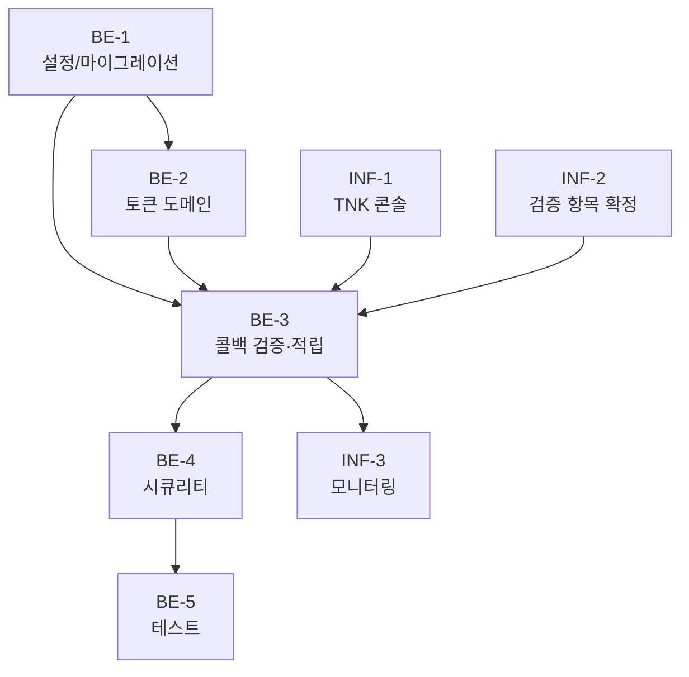

# 혜택존 — TNK 오퍼월 백엔드 작업 체크리스트

> Source spec: `docs/features/offerwall/spec.md`
> 범위: 백엔드 (`domain/offerwall/`). 프론트/SDK 통합은 별도 작업.
> 패턴 준용: `domain/ad`(Google SSV 콜백·멱등 적립), `domain/point`(멱등성 트랜잭션).

## Back-End

### BE-1. 설정 및 마이그레이션 (선결)

- [ ] `TnkOfferwallProperties` (`app.offerwall.tnk.*`): `app-key`(시크릿), `point-to-coin-ratio`(기본 1.0), `ack.success-body`(기본 `SUCCESS`)
- [ ] Flyway `V11__tnk_offerwall.sql`: `offerwall_user_tokens`, `tnk_offerwall_callbacks` 테이블 생성 (spec "데이터 모델" 표 기준)
- [ ] `PointTransactionReason.OFFERWALL` enum 값 추가 (기존 `LEDGER_REWARD`와 분리)
- [ ] dev(H2 MySQL 호환) / prod(MySQL) 양쪽 검증

### BE-2. 사용자 토큰 도메인

- [ ] `OfferwallUserToken` 엔티티 (`userId` PK, `token` UUID UNIQUE)
- [ ] `OfferwallUserTokenRepository` (`findByUserId`, `findByToken`)
- [ ] `OfferwallUserTokenService`
  - [ ] `tokenFor(userId)` — get-or-create 멱등 (동시 생성 시 `createInitialPoint` 패턴으로 UNIQUE 충돌 흡수)
  - [ ] `resolveUserId(token): Long?`
- [ ] `OfferwallController.issueUserToken` (`POST /api/offerwall/tnk/user-token`, 인증 사용자) → `{ token }`

### BE-3. TNK 콜백 검증·적립 도메인

- [ ] `TnkOfferwallCallback` 엔티티 (`seq_id` UNIQUE, `md_user_nm`, `userId`(nullable), `payPnt`, `coinAmount`, `status`, `rawQuery`)
  - [ ] `status` enum: `GRANTED` / `REJECTED_BAD_SIGNATURE` / `REJECTED_UNKNOWN_USER` (확장 여지: `CANCELED`)
- [ ] `TnkOfferwallCallbackRepository` (`findBySeqId`)
- [ ] `TnkMdChecksumVerifier` — `md_chk == MD5(appKey + md_user_nm + seq_id)` 재계산 검증 (산식은 spec "검증 필요 항목"의 TODO 반영, 상수/유틸로 분리)
- [ ] `TnkOfferwallService.handleCallback(params, now)` — **단일 `@Transactional`**
  - [ ] `md_chk` 검증 실패 → `REJECTED_BAD_SIGNATURE` 기록 후 종료
  - [ ] `seq_id` 선검사(`findBySeqId`) → 이미 존재 시 멱등 종료(추가 적립 없음)
  - [ ] `md_user_nm` → `resolveUserId` 미해석 시 `REJECTED_UNKNOWN_USER` 기록(`user_id` null)
  - [ ] `coinAmount = floor(payPnt × point-to-coin-ratio)` 산출
  - [ ] `UserPointService.recordTransaction(reason=OFFERWALL, key="tnk:offerwall:{seq_id}")` 호출 (멱등키 = 이중 방어선)
  - [ ] `tnk_offerwall_callbacks` `GRANTED` INSERT
- [ ] `OfferwallController.handleTnkCallback` (`POST /api/offerwall/tnk/callback`, 비인증)
  - [ ] 성공/멱등 → 성공 ack(HTTP 200 + `ack.success-body`)
  - [ ] 거절 → ledger 기록 후 재전송 폭주 방지 응답 (ack 정책은 spec D5 / 검증 항목 반영)
- [ ] `OfferwallExceptionHandler` (필요 시 도메인 예외 매핑)

### BE-4. 시큐리티 설정

- [ ] `/api/offerwall/tnk/callback`을 인증 예외 경로(permitAll)로 등록 (TNK 서버 호출, JWT 없음) — 기존 `/api/ads/google/ssv` 설정 참고
- [ ] `/api/offerwall/tnk/user-token`은 인증 필요 경로 유지

### BE-5. 테스트 (Kotest + TestContainers MySQL)

- [ ] 토큰: 최초 발급 / 재호출 동일 토큰 / 동시 최초 호출 단일 생성(통합)
- [ ] 콜백 정상 적립: `md_chk` 통과 → 적립 + ratio 반영 + `GRANTED` 기록
- [ ] 환산비: 정수/소수 ratio에서 `floor` 올바름, 과적립 없음
- [ ] 서명 실패 → `REJECTED_BAD_SIGNATURE`, 무적립
- [ ] 미지 토큰 → `REJECTED_UNKNOWN_USER`, 무적립, `user_id` null
- [ ] 중복 `seq_id` 멱등 → 이중 적립 없음
- [ ] **동시성**: 동일 `seq_id` 동시 2건 → 정확히 1건 적립, 나머지 멱등 (회귀 방지)
- [ ] 컨트롤러 WebMvc: 토큰 발급 응답 / 콜백 ack 본문·상태코드

## Infra / 운영

### INF-1. TNK 콘솔

- [ ] TNK 파트너 콘솔에서 앱 등록 및 `app-key` 발급
- [ ] dev / prod 서버 포스트백 콜백 URL 등록 (`https://api.../api/offerwall/tnk/callback`)
- [ ] `app-key`를 dev/prod application secret에 주입

### INF-2. 검증 필요 항목 확정 (spec "검증 필요 항목")

- [ ] 포스트백 HTTP 메서드·파라미터 전달 방식 확인 → 컨트롤러 매핑 확정
- [ ] `md_chk` 정확한 산식(연결 순서·인코딩) 확인 → `TnkMdChecksumVerifier` 확정
- [ ] 성공/실패 ack 본문·상태코드 확인 → `ack.success-body` 상수 조정
- [ ] 취소/환수 콜백 규격 확인 → 후속 자동화(D3) 범위 결정

### INF-3. 모니터링

- [ ] `tnk_offerwall_callbacks.status = REJECTED_*` 비율 알람
- [ ] 적립 합계 sanity 체크(오퍼월 채널 코인 적립 추이)

## 작업 흐름 (Workflow)

선행 관계 요약:

- `BE-1`(설정/마이그레이션/`OFFERWALL` 사유)이 먼저 테이블·설정을 준비한다.
- `BE-2`(토큰) → `BE-3`(콜백)은 토큰 해석에 의존하므로 순차.
- `INF-1`(TNK 콘솔 `app-key`)·`INF-2`(검증 항목)는 `BE-3` 콜백의 실제 동작 검증 전제 — 코드 구현은 합리적 기본값으로 선행 가능(D5).
- 단일 백엔드 PR로 묶을 수 있는 규모이나, 필요 시 `BE-2 토큰` / `BE-3 콜백` 2개 PR로 분할 가능.
