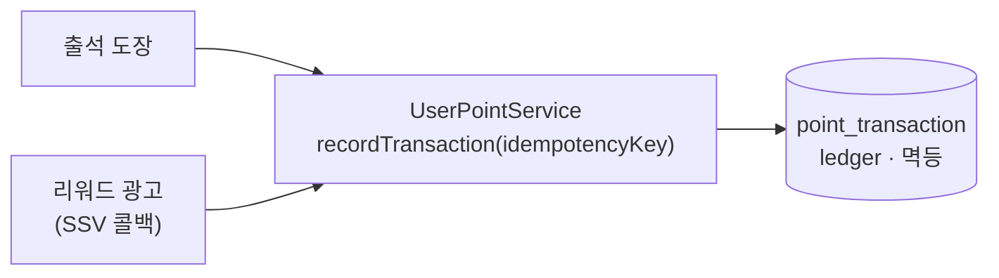
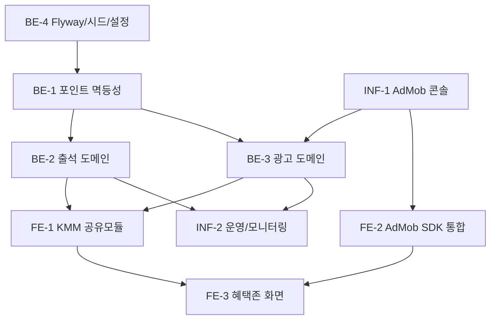

# [RFC] 혜택존 Phase 1 — 출석체크 · 리워드 광고

| | |
|---|---|
| **Status** | `Draft` → In Review → Approved → Implemented |
| **Author** | 최지웅 (Backend) |
| **Reviewers / Approvers** | @FE 리드 · @Infra 담당 (각 직군 1인 승인 필요) |
| **Jira** | CC-287 |
| **Last updated** | 2026-05-30 |

## 1. 요약 (Summary)

혜택존 탭 Phase 1로 **일일 출석체크**와 **AdMob 리워드 광고** 두 개의 코인 적립 채널을 추가한다. 두 채널 모두 `UserPointService.recordTransaction(idempotencyKey)`의 멱등성 트랜잭션으로 적립해 **중복·위조·동시성 적립을 차단**한다. 광고 적립은 클라이언트를 신뢰하지 않고 **서버 발급 nonce + AdMob SSV 서버 콜백** 경로로만 지급한다. TNK 오퍼월·데일리 미션은 Phase 2다.

## 2. 맥락 (Context)

상위 기획안(혜택존)에서 코인 흐름은 **적립(오퍼월·출석·광고) → 소비(상점)** 구조로 설계됐다. Phase 1은 외부 연동이 가장 가벼운 두 채널(출석·리워드 광고)을 먼저 출시해 코인 이코노미의 적립단을 검증하는 단계다. 적립 무결성은 이후 모든 적립/소비 도메인이 공유하는 토대이므로, 본 RFC에서 `UserPointService`의 멱등성 적립 모델을 함께 확정한다(Shop spec과 공유되는 선결 조건).

- 관련 기획: [혜택존(14909530)](https://moneyfactoryslave.atlassian.net/wiki/spaces/FCTC/pages/14909530), [overview(14975052)](https://moneyfactoryslave.atlassian.net/wiki/spaces/FCTC/pages/14975052)

## 3. 목표 (Goal)

**달성하려는 것**

- 일일 출석 도장 + 연속/누적 일차 보상(7·14·30일 부가 보상)
- AdMob 리워드 광고 시청 → 서버 SSV 검증 후 코인 적립, 일일 한도 N회
- 중복 적립·위조 적립·동시성(TOCTOU) 방어
- `UserPointService` 멱등성 확장(공통 선결 조건)

**이번 범위에서 다루지 않는 것 (Non-Goals)**

- TNK Factory 오퍼월, 데일리 미션 → Phase 2
- 친구 초대 보상, 디바이스 핑거프린팅 어뷰징 방지
- 31일+ 출석 사이클 정책 → §9 Open Questions
- 적립 후 환수(revoke)/운영자 수동 조정, 보상 환산비 동적 조정(관리자 UI)
- AdMob 네이티브/인터스티셜 광고(Chat 탭 광고는 별도 spec)

## 4. 제안 (Proposal)

세 도메인으로 구성하고, 모든 적립은 멱등성 ledger를 거친다.

- **`domain/point/`** (공통 선결) — `PointTransaction` ledger + `recordTransaction(userId, delta, reason, idempotencyKey)`. 동일 키 재호출 시 기존 트랜잭션 반환, 잔액 부족 시 `INSUFFICIENT_COIN`.
- **`domain/attendance/`** — `checkIn`은 **단일 `@Transactional`** 안에서 `attendance_log` INSERT + 연속 일차 계산 + 보상 적립을 원자적으로 수행. 한쪽 실패 시 전체 롤백("도장만 찍히고 코인 없음" 방지). 멱등성 키 `attendance:{userId}:{yyyy-MM-dd}`(KST).
- **`domain/ad/`** — nonce 발급 → 광고 → SSV 콜백 적립. 한도 검사·증가·적립을 단일 트랜잭션 + 행 락으로 원자화.

상세 인수 기준·시퀀스 다이어그램·엔티티 정의는 repo `docs/features/reward/spec.md` 참조(본 문서에 복제하지 않음).

### API 설명

| Method | Path | 설명 |
|--------|------|------|
| `POST` | `/api/attendance/check-in` | 오늘 도장 + 보상 응답(적립 코인·연속 일차·다음 보상 미리보기). 같은 날 재호출 시 409 `ALREADY_CHECKED_IN` |
| `GET`  | `/api/attendance/me` | 월간 캘린더 + 연속일 + 오늘 여부. Query `year=YYYY`·`month=1~12`(둘 다 또는 둘 다 생략; 한쪽만 전달 시 400, 둘 다 생략 시 KST 현재 연·월) |
| `POST` | `/api/ads/reward/issue-nonce` | 광고 시청 직전, SSV 매핑용 단일 사용·단기 TTL(예 10분) nonce 발급. 응답 `{ nonce, expiresAt }` |
| `GET`  | `/api/ads/ssv/admob` | AdMob 서버 SSV 콜백(모든 파라미터 query string). 서명 검증 → `custom_data.nonce`로 userId 해석 → 멱등 적립 |
| `GET`  | `/api/ads/reward/quota` | 오늘 남은 시청 횟수 `{ usedToday, dailyLimit, remaining, resetAtKst }` |

> 계약의 단일 소스는 **OpenAPI 스펙**으로 관리한다(FE↔BE 동결 후 변경 시 PR 리뷰). 위 표는 요약.

## 5. 대안 (Alternatives)

| 결정 지점 | 채택 | 검토 후 배제 | 배제 이유 |
|-----------|------|--------------|-----------|
| 광고 적립 사용자 식별 | **서버 발급 nonce → userId 해석** | `custom_data`의 userId 직접 신뢰 | client-controlled 필드라 타 계정 적립 위조 가능 |
| 동시 SSV 한도 경합 | **단일 트랜잭션 + row `SELECT … FOR UPDATE`** | 분산 락(Redis 등) | per-user-per-day 행 락으로 충분, 인프라 추가 불필요 |
| 중복 적립 방지 | **멱등성 키 ledger** | 유니크 제약만 | 멱등 키는 출석·광고·상점이 공유하는 공통 모델로 재사용 |
| 적립 원자성 | **단일 `@Transactional`** | 이벤트/후처리 분리 | 부분 성공("도장만, 코인 없음") 차단이 최우선 |

## 6. 장단점 (Trade-offs)

채택안(nonce + 멱등 ledger + 행 락) 기준:

- **장점**
  - 클라이언트 무신뢰 모델 → 위조 userId·재전송 모두 서버에서 차단
  - 멱등 ledger가 출석·광고·상점 공통 → 적립 도메인 추가 시 재사용
  - 행 락 방식이라 별도 인프라(Redis 등) 없이 TOCTOU 방어
- **단점 / 비용**
  - nonce 발급 → 광고 → SSV의 왕복이 늘어 FE 흐름이 한 단계 복잡(issue-nonce 선행)
  - `ad_reward_nonce` 만료/정리(cleanup) 부담 발생
  - per-user-per-day 행 락은 동일 사용자 고빈도 동시 시청 시 직렬화(실사용 빈도상 영향 미미)

## 7. 위험 (Risks)

### 보안 (Security) — 위협 모델과 방어선

1. **위조 userId** — `custom_data`의 식별값 미신뢰. 서버 발급 **단일 사용 nonce만** 싣고 백엔드가 `nonce → userId` 해석.
2. **서명 위조** — SSV `signature`를 AdMob 공개키(ECDSA)로 검증. 실패 시 401 + ledger `BAD_SIGNATURE`.
3. **재전송(중복)** — nonce `used=true` 1차 방어 + 멱등성 키 `admob:reward:{nonce}` 2차 방어(이중 방어선).
4. **동시성(TOCTOU)** — 한도 검사·증가를 단일 트랜잭션 + `ad_reward_daily_quota` 행 락으로 원자화. 동시 콜백 중 정확히 한쪽만 GRANT.
5. **재시도 폭주** — 거부 케이스(INVALID_NONCE·OVER_QUOTA)도 AdMob엔 200 반환, ledger에 사유 기록.

### 운영 / 기타 위험

- AdMob 공개키 fetch 실패 시 검증 불가 → 폴백/알람 필요(§8 모니터링)
- 시드 코인값·일일 한도가 가설 단계 → 출시 후 코인 인플레 리스크(§9에서 추적)
- KST 자정 경계의 일자 판정 오류 가능 → 멱등성 키·리셋 모두 `Asia/Seoul` 고정

## 8. 계획 (Plan)

### Rollout / Migration

- **Flyway**(dev H2 + prod MySQL): `point_transaction`, `attendance_log`, `attendance_reward`, `ad_reward_nonce`, `ad_reward_daily_quota`, `ad_reward_ledger`
- **시드 데이터**: 출석 보상 표(부록) SQL
- **설정**: `reward.admob.daily-limit`, `reward.admob.public-keys-url`, `reward.admob.reward-coin`
- **AdMob 콘솔(Infra 선행)**: 광고 단위(Android/iOS) 생성 → SSV URL dev/prod 등록 → 테스트 디바이스 등록 → 광고 단위 ID를 dev/prod secret 주입
- **모니터링(Runbook 별도)**: 공개키 fetch 실패 폴백/알람, `ledger.status=REJECTED` 비율 알람, `point_transaction` 음수 잔액 sanity 배치

### 작업 분담 및 의존성

- **BE**: 멱등성 확장(BE-1, Shop과 공유) → 출석(BE-2)/광고(BE-3) → 설정·마이그레이션(BE-4)
- **FE**: KMM 공유모듈(FE-1) → AdMob SDK Android/iOS(FE-2) → 혜택존 화면(FE-3). nonce는 **서버 발급분만 전달**, 직접 생성 금지
- **Infra**: AdMob 콘솔/SSV URL(INF-1, BE-3 선행) → 운영 알람(INF-2)

세부 체크리스트는 repo `docs/features/reward/tasks.md`.

## 9. 해결되지 않은 사항 (Open Questions)

| 질문 | 현재 가설 | 담당 | 상태 |
|------|-----------|------|------|
| 31일+ 출석 사이클 정책(streak 리셋·부가보상 재지급 시점) | `누적일차 % 30` 재진입 | 기획+BE | **미결** |
| 시드 코인값(1일 +20 … 30일 +300) 확정 | spec 부록 표(가설) | 기획 | 검토 필요 |
| 광고 일일 한도 / 시청당 코인 | 10회 / 40코인(고정값) | 기획+BE | 검토 필요 |
| 시청당 코인 DB 이관 시점 | Phase 1 고정값 → 후속 이관 | BE | 후속 |

## 10. 참고 (Reference)

- repo: `docs/features/reward/spec.md`(AC·시퀀스 다이어그램), `tasks.md`(체크리스트)
- ADR(작성 예정): ① 광고 적립은 서버 SSV 경로로만, client 식별값 미신뢰 ② 포인트 적립 멱등성은 idempotencyKey ledger로 보장
- 상위 기획안 혜택존(14909530), overview(14975052)

### 부록 — Phase 1 시드값

| 누적 일차 | 코인 | 부가 보상 |
|-----------|------|-----------|
| 1~6일 | +20 | - |
| 7일 | +50 | `EVO_STONE`×1 |
| 14일 | +100 | `EVO_STONE`×2, `LUCK_CHARM`×1 |
| 30일 | +300 | `PROTECT_TICKET`×1 |

일자 판정·멱등성 키 모두 `Asia/Seoul` 기준. `itemCode`는 Shop spec `shop_item.itemCode`와 동일 키.
