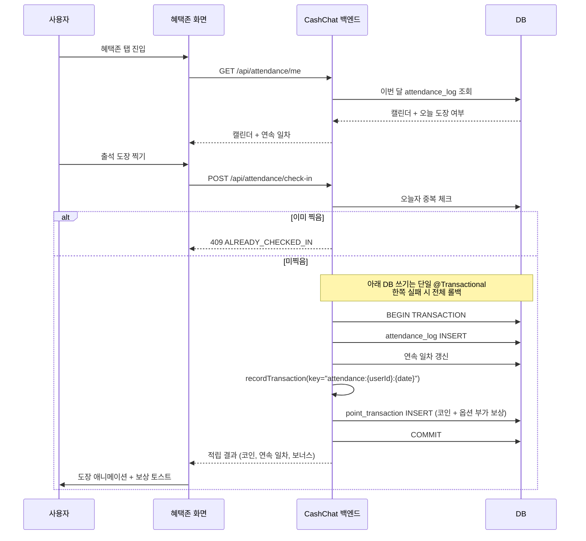
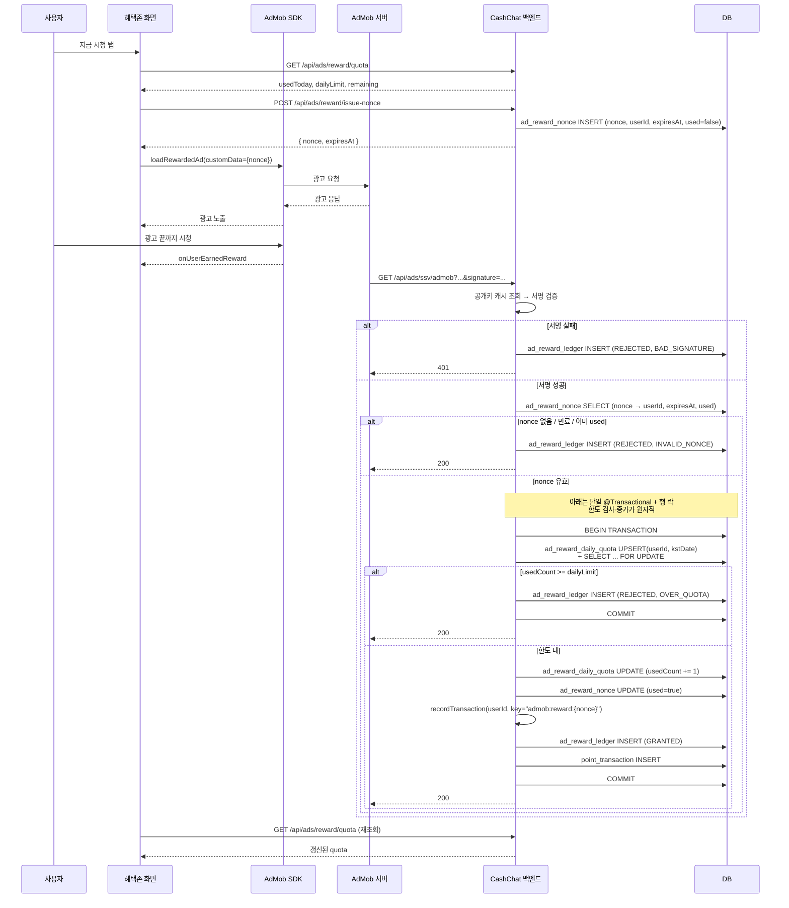

# 혜택존(Reward) Phase 1 — 출석체크 · 리워드 광고 Spec

> 상태: Draft
> 범위: Phase 1 (출석체크 + AdMob 리워드 광고)
> 관련 기획: [Confluence — 혜택존](https://moneyfactoryslave.atlassian.net/wiki/spaces/FCTC/pages/14909530), [Confluence — overview](https://moneyfactoryslave.atlassian.net/wiki/spaces/FCTC/pages/14975052/Cash+Chat+-+overview), `docs/planning/02-rewards-zone.md`

## 목표 (Goal)

혜택존 탭의 Phase 1로 두 가지 코인 적립 채널을 제공한다.

1. **일일 출석체크**: 하루 1회 도장 → 보상 코인(+옵션 부가 보상). 연속 출석 카운트와 누적 일차별 보상 차등.
2. **AdMob 리워드 광고 시청**: 1일 N회까지 광고 시청 → 서버 SSV 검증 후 코인 적립.

두 채널 모두 `domain/point/UserPointService`의 멱등성 보장 트랜잭션을 통해 코인을 적립한다. 본 spec은 `UserPointService.recordTransaction(idempotencyKey)` 확장을 함께 다룬다 (Shop spec과 공유되는 선결 조건).

## 유저 스토리 (User Story)

### Story 1: 신규 출석 도장

신규/기존 사용자는 혜택존 탭에서 오늘자 도장을 1회 찍어 코인을 받고 싶다. 어제 도장을 찍었다면 연속 일차가 1 증가하고, 끊겼다면 1일차로 리셋된다.

### Story 2: 누적 일차 보너스

연속 출석 7일/14일/30일 시점에는 코인 외 부가 보상(진화석, 확률 부적, 보호권)을 함께 받고 싶다. 보너스는 해당 누적 일차 도달 시 1회만 지급된다.

### Story 3: 리워드 광고 시청

사용자는 혜택존의 [지금 시청] 버튼으로 AdMob 리워드 광고를 보고 코인을 받고 싶다. 광고를 끝까지 보지 않으면 코인이 지급되지 않는다.

### Story 4: 광고 일일 한도

운영 정책상 사용자당 하루 N회로 광고 시청을 제한하고 싶다. 한도를 초과하면 시청 버튼은 비활성화되고, KST 자정에 리셋된다.

### Story 5: 적립 무결성 (중복·위조 방어)

백엔드는 다음 두 가지를 모두 만족해야 한다.

1. AdMob이 동일한 reward callback을 재전송하거나 동일 nonce가 동시에 도착할 때 코인을 중복 적립하지 않는다.
2. AdMob `custom_data`는 클라이언트가 임의로 채울 수 있는 필드이므로 그 안의 `userId` 같은 식별값을 백엔드가 직접 신뢰하지 않는다 — 위조된 `userId`로 다른 사용자 계정에 적립이 일어나면 안 된다. 백엔드는 광고 시청 직전에 서버가 발급한 단일 사용 nonce만 받아 `nonce → userId`를 서버측에서 해석한다.

출석도 마찬가지로 동일 일자 중복 도장을 거부해야 한다.

## 인수 기준 (Acceptance Criteria)

### 첫 출석

Given 사용자가 가입 직후이고 오늘 출석 기록이 없다
When 사용자가 `POST /api/attendance/check-in`을 호출한다
Then 백엔드는 **단일 DB 트랜잭션(`@Transactional`) 안에서** `attendance_log` 오늘자 1행 INSERT와 `UserPointService.recordTransaction(idempotencyKey="attendance:{userId}:{yyyy-MM-dd}")` 호출을 함께 수행한다
And 연속 출석 일차는 1로 저장된다
And 1일차 보상 시드값(예: +20 코인)이 적립되어 같은 트랜잭션 안의 `point_transaction`에 1행이 기록된다
And 둘 중 어느 한쪽이라도 실패하면 트랜잭션 전체가 롤백되어 "도장만 찍히고 코인 없음" 같은 부분 성공 상태가 발생하지 않는다
And 응답에는 적립된 코인, 연속 일차, 다음 보상 미리보기가 포함된다.

### 같은 날 중복 출석

Given 사용자가 오늘 이미 출석을 찍었다
When 같은 사용자가 같은 날 `POST /api/attendance/check-in`을 다시 호출한다
Then 백엔드는 409 도메인 에러(`ALREADY_CHECKED_IN`)로 거부한다
And `attendance_log`에 추가 행이 생기지 않는다
And 코인이 추가로 적립되지 않는다.

### 연속 출석 카운트 증가

Given 사용자의 가장 최근 출석일이 어제(KST 기준)이다
When 오늘 출석을 찍는다
Then 연속 일차는 어제 일차 + 1로 저장된다.

### 연속 출석 끊김

Given 사용자의 가장 최근 출석일이 2일 이상 전(KST 기준)이다
When 오늘 출석을 찍는다
Then 연속 일차는 1로 리셋된다.

### 7일/14일/30일 누적 일차 보너스

Given 사용자의 누적 출석 일차가 시드 테이블의 보너스 지급 일차(7/14/30)에 도달한다
When 해당 회차 출석을 찍는다
Then 코인 외 부가 보상(진화석/확률 부적/보호권 등) 시드값이 추가로 지급된다
And 코인·부가 보상 적립은 `attendance_log` 갱신과 동일 트랜잭션 안에서 수행되며 (위 "첫 출석" 기준의 원자성 규칙이 동일하게 적용된다), 어느 한쪽 실패 시 트랜잭션 전체가 롤백된다
And 본 인수 기준은 누적 1~30일 범위만 정의한다 — 31일 이후 사이클 정책은 Phase 1 범위 외(부록 참고).

### 캘린더 조회

Given 사용자가 이번 달 출석을 7일 동안 찍었다
When 사용자가 `GET /api/attendance/me`를 호출한다
And 선택 query 파라미터 `year` (형식 `YYYY`)와 `month` (정수 1~12)는 **둘 다 함께 전달하거나 둘 다 생략**한다 — 한쪽만 전달하면 400 거부, 둘 다 생략 시 KST 기준 현재 연·월로 해석한다
Then 응답은 `{ year, month, checkedDays:[1..7], currentStreak:7, todayChecked:true, nextRewardPreview:{...} }` 형태로 반환되며 `year`/`month`는 요청에 사용된(또는 기본으로 채워진) 값을 그대로 반영한다.

### nonce 발급 (광고 시청 직전)

Given 인증된 사용자가 광고 시청 직전이다
When 사용자가 `POST /api/ads/reward/issue-nonce`를 호출한다
Then 백엔드는 단일 사용·짧은 TTL(예: 10분)의 nonce 1건을 `ad_reward_nonce`에 저장한다 (`nonce`, `userId`, `expiresAt`, `used=false`)
And 응답은 `{ nonce, expiresAt }` 형태로 반환된다
And 이 nonce가 AdMob `custom_data`의 `nonce` 필드에만 실려야 하며, 클라이언트는 `userId` 등 식별값을 `custom_data`에 직접 넣지 않는다.

### 광고 일일 한도 내 시청

Given 사용자가 `POST /api/ads/reward/issue-nonce`로 발급받은 nonce가 미사용·미만료 상태이다
And `ad_reward_daily_quota`의 `(userId, kstDate)` 행 `usedCount`가 일일 한도 미만이다
When AdMob이 SSV 콜백을 `GET /api/ads/ssv/admob?...`(query string)으로 보내고, `custom_data`에는 nonce만 포함된다
And 백엔드가 query string의 `signature`를 AdMob 공개키로 검증한다
And 백엔드가 `custom_data.nonce`로 `ad_reward_nonce`를 조회해 표준 `userId`를 해석한다 (`custom_data` 안의 다른 식별값은 신뢰하지 않음)
Then 백엔드는 **단일 트랜잭션 안에서** 다음을 순서대로 수행한다 — (a) `ad_reward_daily_quota`의 `(userId, kstDate)` 행을 `SELECT ... FOR UPDATE`로 락을 잡아 `usedCount`를 다시 읽고 한도 미만임을 재확인, (b) `usedCount += 1`, (c) `ad_reward_nonce.used=true` UPDATE, (d) `UserPointService.recordTransaction(멱등성 키 "admob:reward:{nonce}")` 호출, (e) `ad_reward_ledger`에 `status=GRANTED`로 INSERT, (f) COMMIT
And 위 절차는 트랜잭션 내부에서 한도 검사·증가가 원자적으로 일어나 동시 도착하는 SSV 둘이 동일 시점 `usedCount`를 읽고 모두 통과하는 TOCTOU 경합이 발생하지 않는다
And 같은 사용자의 `GET /api/ads/reward/quota` 응답에 남은 횟수가 감소된 값으로 반영된다.

### 위조 또는 만료된 nonce 거부

Given AdMob SSV 콜백이 도착했고 서명 검증은 통과했다
And `custom_data`의 nonce가 (a) `ad_reward_nonce`에 없거나 (b) `expiresAt`을 지났거나 (c) 이미 `used=true`이다
When 백엔드가 콜백을 처리한다
Then 백엔드는 적립을 거부한다
And `ad_reward_ledger`에 `status=REJECTED`, `reason=INVALID_NONCE`로 기록한다
And 코인이 적립되지 않는다
And AdMob에는 200을 반환한다 (재시도 폭주 방지).

### 광고 일일 한도 초과

Given `ad_reward_daily_quota`의 `(userId, kstDate)` 행 `usedCount`가 일일 한도에 도달했다
When 새 SSV 콜백이 도착하고 서명·nonce 검증을 모두 통과한다
Then 백엔드는 트랜잭션을 시작해 `ad_reward_daily_quota` 행을 `SELECT ... FOR UPDATE`로 락을 잡고 `usedCount >= 한도`를 확인한 뒤 적립을 거부한다
And `ad_reward_ledger`에 `status=REJECTED`, `reason=OVER_QUOTA`로 기록하고 COMMIT한다
And 코인이 적립되지 않으며 `ad_reward_nonce.used`는 변경되지 않는다 (재시도 방지를 위해 nonce는 그대로 미사용으로 두되, 호출 측 동일 nonce 재전송은 어차피 한도 초과로 REJECT)
And AdMob에는 200을 반환한다 (재시도 폭주 방지)
And 동시에 도착한 두 콜백이 같은 행에 락 경쟁을 하므로 한쪽만 통과·다른 쪽은 거부되어 TOCTOU 경합이 발생하지 않는다.

### SSV 서명 검증 실패

Given AdMob 콜백 query string의 `signature`가 공개키 검증에 실패한다
When 백엔드가 콜백을 처리한다
Then 백엔드는 401로 응답한다
And `ad_reward_ledger`에 `status=REJECTED`, `reason=BAD_SIGNATURE`로 기록한다
And 코인을 적립하지 않는다.

### SSV 콜백 중복

Given 동일한 `nonce`로 두 번 SSV 콜백이 도착한다
When 백엔드가 두 번째 콜백을 처리한다
Then 두 번째 콜백은 nonce가 이미 `used=true`이므로 위 "위조 또는 만료된 nonce 거부" 기준에 따라 `INVALID_NONCE`로 REJECTED 처리된다
And 만약 어떤 이유로 적립 단계에 도달하더라도 멱등성 키 `admob:reward:{nonce}` 충돌로 중복 적립되지 않는다 (이중 방어선)
And 두 번째 콜백에도 200을 반환한다.

### Quota 조회

Given 사용자가 오늘 광고를 3회 시청했고 한도는 10회다
When 사용자가 `GET /api/ads/reward/quota`를 호출한다
Then 응답은 `{ usedToday:3, dailyLimit:10, remaining:7, resetAtKst:"..." }` 형태로 반환된다.

## API 계약 (요약)

| Method | Path | 설명 |
| ------ | ---- | ---- |
| `POST` | `/api/attendance/check-in` | 오늘 도장 + 보상 응답 |
| `GET`  | `/api/attendance/me` | 월간 캘린더 + 연속일 + 오늘 여부. Query: `year=YYYY`·`month=1~12` (둘 다 함께 또는 둘 다 생략; 한쪽만 전달은 400). 둘 다 생략 시 KST 현재 연·월. 상세는 인수 기준 "캘린더 조회" 참조. |
| `POST` | `/api/ads/reward/issue-nonce` | 인증된 사용자에게 SSV 매핑용 단일 사용·단기 nonce 발급 |
| `GET`  | `/api/ads/ssv/admob` | AdMob 서버 SSV 콜백 — 모든 파라미터는 query string (AdMob 표준은 GET) |
| `GET`  | `/api/ads/reward/quota` | 오늘 남은 시청 횟수 |

## 사용자 흐름 (User Flow)

### 출석체크

1. 사용자가 혜택존 탭에 진입한다.
2. 프론트가 `GET /api/attendance/me`로 이번 달 캘린더와 오늘 도장 여부를 조회한다.
3. 사용자가 [출석 도장 찍기]를 누른다.
4. 프론트가 `POST /api/attendance/check-in`을 호출한다.
5. 백엔드가 멱등성 키로 코인을 적립하고 적립 결과를 응답한다.
6. 프론트가 도장 애니메이션과 보상 토스트를 표시한다.

### 리워드 광고

1. 사용자가 혜택존 탭의 [지금 시청] 버튼을 누른다.
2. 프론트가 `GET /api/ads/reward/quota`로 잔여 횟수를 확인한다.
3. 프론트가 `POST /api/ads/reward/issue-nonce`를 호출해 서버 발급 nonce를 받는다.
4. 프론트가 AdMob SDK로 리워드 광고를 로드하고 노출하며, `custom_data`에 `{ nonce }`만 실어 보낸다 (`userId` 등 식별값은 절대 포함하지 않는다).
5. 사용자가 광고를 끝까지 시청한다.
6. AdMob이 백엔드로 SSV 콜백을 전송한다.
7. 백엔드가 서명을 검증한 뒤 `custom_data.nonce`로 `ad_reward_nonce`를 조회해 `userId`를 해석하고, 멱등성 키로 코인을 적립한다.
8. 프론트가 광고 종료 직후 `GET /api/ads/reward/quota`를 재호출해 적립 반영을 확인한다.

### 순차 흐름도 (Sequence Diagram)

#### 출석체크

#### 리워드 광고

## 범위 외 (Out Of Scope)

- TNK Factory 오퍼월 연동 (`domain/offerwall/`) — Phase 2
- 데일리 미션 (`domain/mission/`) — Phase 2
- 미션 새로고침권, 도장 회복권 (광고 시청으로 사용)
- 친구 초대 보상 및 디바이스 핑거프린팅 어뷰징 방지
- AdMob 네이티브/인터스티셜 광고 (Chat 탭 광고는 Chat 도메인 별도 spec)
- 광고 노출 빈도 제어(Frequency Cap)의 서버측 정책
- 출석/광고 보상 코인 환산비의 동적 조정 (관리자 UI)
- 추가 오퍼월(Buzzvil, AdiSON 등) 통합
- 진화/강화 시스템에서의 부가 보상 아이템 소비 (Inventory consume은 Evolution spec)
- 적립 후 환수(revoke) / 운영자 수동 조정 도메인

## 부록: Phase 1 시드값

### 출석 보상 (`attendance_reward` 테이블 시드)

| 누적 일차 | 코인 | 부가 보상 (`itemCode × qty`) |
| --------- | ---- | ----------------------------- |
| 1~6일     | +20  | -                             |
| 7일       | +50  | `EVO_STONE` × 1               |
| 14일      | +100 | `EVO_STONE` × 2, `LUCK_CHARM` × 1 |
| 30일      | +300 | `PROTECT_TICKET` × 1          |

- 31일+ 처리는 Phase 1 범위 외 — 가설은 "누적 일차 % 30 기준 사이클 재진입"이지만, 구체 규칙(streak 카운터 리셋 여부, 14/30일 부가 보상 재지급 시점)은 별도 의사결정 후 후속 spec에서 확정한다.
- 모든 일자 판정은 `Asia/Seoul` 기준이며, 멱등성 키 `attendance:{userId}:{yyyy-MM-dd}`의 `yyyy-MM-dd`도 KST 자정 기준으로 계산한다.
- 부가 보상의 `itemCode`는 Shop spec의 `shop_item.itemCode`와 동일 키 사용

### 광고 한도 (설정값)

- 일일 시청 한도: 10회 (`application.yml`의 `reward.admob.daily-limit`)
- 시청당 적립 코인: 40코인 (Phase 1 고정값; 후속 DB 이관 가능)
- KST 자정 리셋
