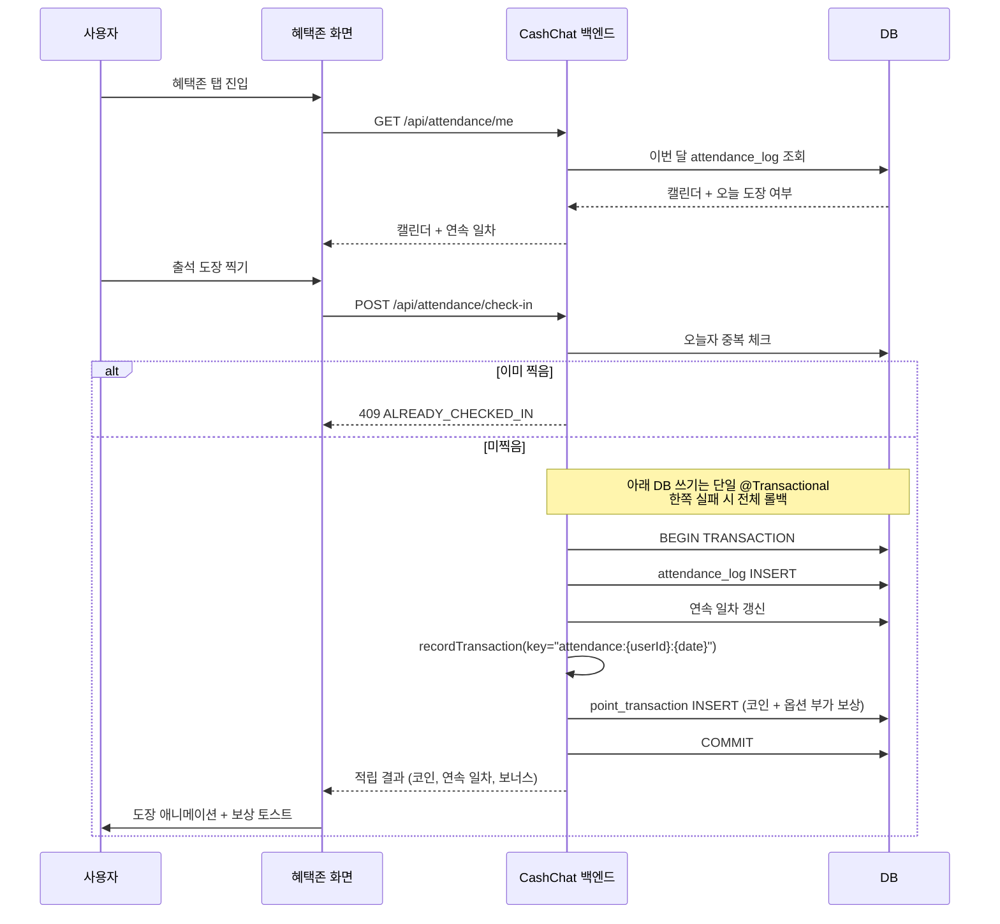
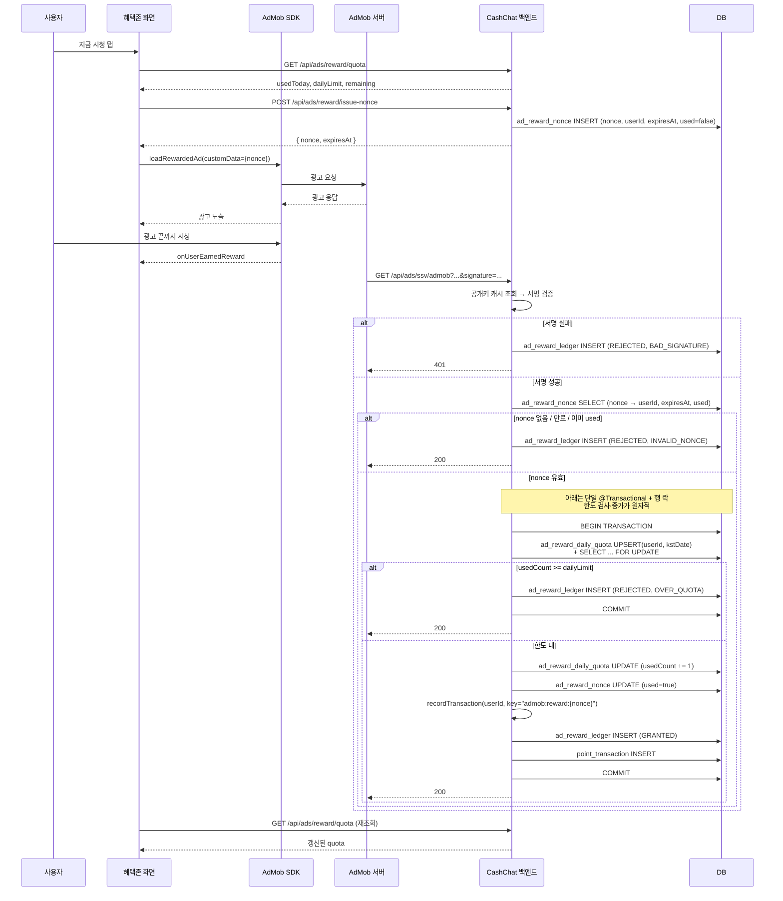

# 혜택존(Reward) Phase 1 — 출석체크 · 리워드 광고 기술 설계

> 상태: Draft
> 범위: Phase 1 (출석체크 + AdMob 리워드 광고)
> 유저 스토리·인수 조건(SSOT): [US-REWARD-001](../../domains/reward/US-REWARD-001-daily-attendance.md), [US-REWARD-002](../../domains/reward/US-REWARD-002-rewarded-ad.md)
> 관련 기획: [Confluence — 혜택존](https://moneyfactoryslave.atlassian.net/wiki/spaces/FCTC/pages/14909530), [Confluence — overview](https://moneyfactoryslave.atlassian.net/wiki/spaces/FCTC/pages/14975052/Cash+Chat+-+overview), `docs/planning/02-rewards-zone.md`

## 목표 (Goal)

혜택존 탭의 Phase 1로 두 가지 코인 적립 채널을 제공한다.

1. **일일 출석체크**: 하루 1회 도장 → 보상 코인(+옵션 부가 보상). 연속 출석 카운트와 누적 일차별 보상 차등.
2. **AdMob 리워드 광고 시청**: 1일 N회까지 광고 시청 → 서버 SSV 검증 후 코인 적립.

두 채널 모두 `domain/point/UserPointService`의 멱등성 보장 트랜잭션을 통해 코인을 적립한다. 본 spec은 `UserPointService.recordTransaction(idempotencyKey)` 확장을 함께 다룬다 (Shop spec과 공유되는 선결 조건).

## 유저 스토리 · 인수 조건

> 이 기능의 **유저 스토리와 관찰 가능한 인수 조건(검증 기준선)** 은 도메인 카탈로그가 단일 소유한다(SSOT):
> - [US-REWARD-001 일일 출석체크](../../domains/reward/US-REWARD-001-daily-attendance.md)
> - [US-REWARD-002 리워드 광고 시청](../../domains/reward/US-REWARD-002-rewarded-ad.md)
>
> 본 문서는 그 계약을 만족시키는 **백엔드 구현 상세**(API 계약·데이터 흐름·트랜잭션 불변식·시퀀스)를 담는다.

## 구현 불변식 (Design Invariants)

관찰 가능한 AC는 위 US 파일이 소유하고, 아래는 그것을 보장하는 백엔드 구현 규칙이다. 트랜잭션 흐름의 시각적 표현은 아래 "사용자 흐름 > 순차 흐름도" 참조.

### 출석 적립

- 도장(`attendance_log` INSERT)과 코인/부가 보상 적립(`recordTransaction`)은 **단일 `@Transactional`** 으로 묶어 부분 성공을 배제한다(한쪽 실패 시 전체 롤백).
- 멱등성 키 `attendance:{userId}:{yyyy-MM-dd}` — `yyyy-MM-dd`는 KST 자정 기준. 같은 날 중복 도장은 `409 ALREADY_CHECKED_IN`.
- 연속 일차: 최근 출석일이 어제면 +1, 2일 이상 전이면 1로 리셋(KST 기준).
- 누적 보너스는 1~30일만 정의(부록 시드). 31일 이후 사이클은 범위 외.

### 광고 적립 (AdMob SSV)

- nonce는 **단일 사용·단기 TTL**. `custom_data`는 클라이언트가 임의로 채우는 값이라 신뢰하지 않고, `custom_data.nonce → userId`를 서버측에서 해석한다(위조 `userId` 차단).
- 정상 적립은 **단일 트랜잭션 + `ad_reward_daily_quota` 행 락(`SELECT ... FOR UPDATE`)** 안에서 한도 재확인 → `usedCount += 1` → `nonce.used=true` → 멱등 적립(`admob:reward:{nonce}`) → ledger `GRANTED` 순으로 수행 → 동시 콜백 간 TOCTOU 경합 차단.
- **거절 처리**: 위조/만료/사용된 nonce → ledger `REJECTED/INVALID_NONCE`, 200. 한도 초과 → 행 락으로 재확인 후 `REJECTED/OVER_QUOTA`, `nonce.used`는 미변경, 200. 서명 실패 → `REJECTED/BAD_SIGNATURE`, 401. (200 반환은 AdMob 재시도 폭주 방지.)
- 멱등 키 `admob:reward:{nonce}`는 콜백 중복에 대한 이중 방어선(nonce.used 검사 + 멱등 키 충돌).
- `ad_reward_ledger.status`는 운영 알람·집계의 단일 source of truth.

## API 계약 (요약)

| Method | Path | 설명 |
| ------ | ---- | ---- |
| `POST` | `/api/attendance/check-in` | 오늘 도장 + 보상 응답 |
| `GET`  | `/api/attendance/me` | 월간 캘린더 + 연속일 + 오늘 여부. Query: `year=YYYY`·`month=1~12` (둘 다 함께 또는 둘 다 생략; 한쪽만 전달은 400). 둘 다 생략 시 KST 현재 연·월. 상세는 인수 기준 "캘린더 조회" 참조. |
| `POST` | `/api/ads/reward/issue-nonce` | 인증된 사용자에게 SSV 매핑용 단일 사용·단기 nonce 발급 |
| `GET`  | `/api/ads/ssv/admob` | AdMob 서버 SSV 콜백 — 모든 파라미터는 query string (AdMob 표준은 GET) |
| `GET`  | `/api/ads/reward/quota` | 오늘 남은 시청 횟수 |

## 사용자 흐름 (User Flow)

### 출석체크

1. 사용자가 혜택존 탭에 진입한다.
2. 프론트가 `GET /api/attendance/me`로 이번 달 캘린더와 오늘 도장 여부를 조회한다.
3. 사용자가 [출석 도장 찍기]를 누른다.
4. 프론트가 `POST /api/attendance/check-in`을 호출한다.
5. 백엔드가 멱등성 키로 코인을 적립하고 적립 결과를 응답한다.
6. 프론트가 도장 애니메이션과 보상 토스트를 표시한다.

### 리워드 광고

1. 사용자가 혜택존 탭의 [지금 시청] 버튼을 누른다.
2. 프론트가 `GET /api/ads/reward/quota`로 잔여 횟수를 확인한다.
3. 프론트가 `POST /api/ads/reward/issue-nonce`를 호출해 서버 발급 nonce를 받는다.
4. 프론트가 AdMob SDK로 리워드 광고를 로드하고 노출하며, `custom_data`에 `{ nonce }`만 실어 보낸다 (`userId` 등 식별값은 절대 포함하지 않는다).
5. 사용자가 광고를 끝까지 시청한다.
6. AdMob이 백엔드로 SSV 콜백을 전송한다.
7. 백엔드가 서명을 검증한 뒤 `custom_data.nonce`로 `ad_reward_nonce`를 조회해 `userId`를 해석하고, 멱등성 키로 코인을 적립한다.
8. 프론트가 광고 종료 직후 `GET /api/ads/reward/quota`를 재호출해 적립 반영을 확인한다.

### 순차 흐름도 (Sequence Diagram)

#### 출석체크

#### 리워드 광고

## 범위 외 (Out Of Scope)

- TNK Factory 오퍼월 연동 (`domain/offerwall/`) — Phase 2
- 데일리 미션 (`domain/mission/`) — Phase 2
- 미션 새로고침권, 도장 회복권 (광고 시청으로 사용)
- 친구 초대 보상 및 디바이스 핑거프린팅 어뷰징 방지
- AdMob 네이티브/인터스티셜 광고 (Chat 탭 광고는 Chat 도메인 별도 spec)
- 광고 노출 빈도 제어(Frequency Cap)의 서버측 정책
- 출석/광고 보상 코인 환산비의 동적 조정 (관리자 UI)
- 추가 오퍼월(Buzzvil, AdiSON 등) 통합
- 진화/강화 시스템에서의 부가 보상 아이템 소비 (Inventory consume은 Evolution spec)
- 적립 후 환수(revoke) / 운영자 수동 조정 도메인

## 부록: Phase 1 시드값

### 출석 보상 (`attendance_reward` 테이블 시드)

| 누적 일차 | 코인 | 부가 보상 (`itemCode × qty`) |
| --------- | ---- | ----------------------------- |
| 1~6일     | +20  | -                             |
| 7일       | +50  | `EVO_STONE` × 1               |
| 14일      | +100 | `EVO_STONE` × 2, `LUCK_CHARM` × 1 |
| 30일      | +300 | `PROTECT_TICKET` × 1          |

- 31일+ 처리는 Phase 1 범위 외 — 가설은 "누적 일차 % 30 기준 사이클 재진입"이지만, 구체 규칙(streak 카운터 리셋 여부, 14/30일 부가 보상 재지급 시점)은 별도 의사결정 후 후속 spec에서 확정한다.
- 모든 일자 판정은 `Asia/Seoul` 기준이며, 멱등성 키 `attendance:{userId}:{yyyy-MM-dd}`의 `yyyy-MM-dd`도 KST 자정 기준으로 계산한다.
- 부가 보상의 `itemCode`는 Shop spec의 `shop_item.itemCode`와 동일 키 사용

### 광고 한도 (설정값)

- 일일 시청 한도: 10회 (`application.yml`의 `reward.admob.daily-limit`)
- 시청당 적립 코인: 40코인 (Phase 1 고정값; 후속 DB 이관 가능)
- KST 자정 리셋
