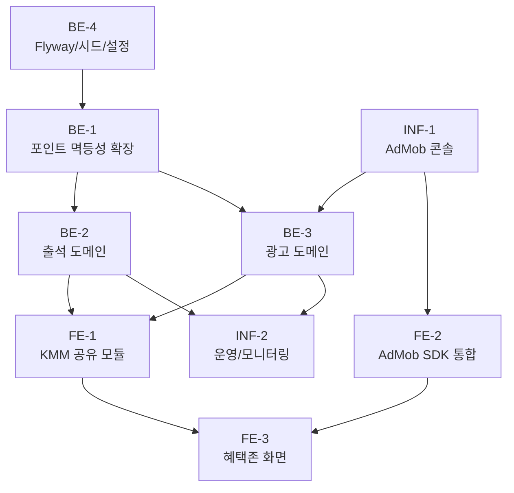

# 혜택존(Reward) Phase 1 — 작업 체크리스트

> Source spec: `docs/features/reward/spec.md`

## Back-End

### BE-1. 포인트 도메인 멱등성 확장 (공통 선결) ✅ (PR1 완료)

- [x] `domain/point/` 아래 `PointTransaction` 엔티티(ledger 테이블)와 Repository 추가
- [x] `UserPointService.recordTransaction(userId, delta, reason, idempotencyKey)` 메서드 추가
- [x] 동일 `idempotencyKey` 재호출 시 기존 트랜잭션을 그대로 반환 (중복 적립 방지)
- [x] 음수 잔액 거부 정책 (delta < 0이고 잔액 부족 시 거부) — 기존 `InsufficientPointsException`(`INSUFFICIENT_POINTS`, HTTP 402) 재사용. spec의 `INSUFFICIENT_COIN`은 신규 코드 추가 대신 기존 코드로 통일
- [x] Kotest 단위 테스트: 정상 적립 / 중복 키 / 잔액 부족 (단위 mock) + 동시 호출 경합 (`PointIdempotencyIntegrationTest`, TestContainers MySQL)

### BE-2. 출석 도메인 (`domain/attendance/`) ✅ (PR2 완료)

- [x] `AttendanceLog`, `AttendanceReward`(시드) 엔티티 정의 — `AttendanceRewardBonus`(부가 보상 정의) 포함, V3 마이그레이션·시드
- [x] `AttendanceService.checkIn(userId, todayKst)` 구현 — 단일 `@Transactional`로 로그+코인 원자 적립
  - [x] 중복 일자 거부 → `ALREADY_CHECKED_IN` (409)
  - [x] 연속 일차 계산 (전일 출석 여부에 따라 +1 또는 1로 리셋)
  - [x] 누적 일차 기반 보상 lookup (`day_count=0` 기본 폴백 + 7/14/30 마일스톤)
  - [x] `UserPointService.recordTransaction(key="attendance:{userId}:{date}")` 호출 (KST)
- [x] `AttendanceService.getMonthly(userId, year, month)` 구현 — year/month 둘 다/둘 다 생략, 한쪽만 400
- [x] `AttendanceController` (`POST /api/attendance/check-in`, `GET /api/attendance/me`)
- [x] Kotest 테스트: 첫 출석 / 중복 / 연속 증가 / 끊김 리셋 / 7일 부가 보상 (단위) + 컨트롤러 WebMvc + TestContainers 통합(첫 출석·중복·7일 시드값)
  - 31일+ 정식 "월간 사이클" 정책은 후속 PR 예정(Confluence 가설 존재). 현재 구현은 모든 31일+ 일차에 대해 기본 폴백으로 20코인을 지급(보너스/streak 리셋 없음)
  - **부가 보상 아이템(EVO_STONE 등)은 정의·미리보기만 제공, 실제 인벤토리 지급은 미구현** — 인벤토리/아이템 도메인(Shop/Evolution) 등장 시 연결

### BE-3. 광고 도메인 (`domain/ad/`) ✅ (PR3 완료)

> SSV 서명 검증·콜백 수신(`GET /api/ads/google/ssv`)·이벤트 로깅(`google_ad_ssv_events`)은 **cc-242(#146)가 선제 구현**. 본 PR3은 그 위에 리워드 적립 레이어를 통합. nonce는 SSV `user_id` 필드로 전달(설계 D1), 멱등성 키 `admob:reward:{transactionId}`(D2), 적립 결과는 `GoogleAdSsvEvent.rewardStatus` 확장으로 기록(D3). 설계: `docs/superpowers/specs/2026-05-31-reward-be3-ad-reward-design.md`.

- [x] `AdRewardNonce` 엔티티 (`nonce` PK, `userId`, `expiresAt`, `used`) — 서버 발급 nonce ↔ userId 매핑 (단일 사용, 단기 TTL)
- [x] `AdRewardDailyQuota` 엔티티 (`(userId, kstDate)` composite PK, `usedCount`) — `SELECT ... FOR UPDATE` 락 대상
- [x] ~~`AdRewardLedger` 엔티티~~ → cc-242의 `GoogleAdSsvEvent.rewardStatus`(GRANTED/REJECTED_INVALID_NONCE/REJECTED_OVER_QUOTA) 확장으로 대체(별도 ledger 불필요, D3)
- [x] `AdRewardNonceService.issueFor(userId)` (TTL·UUID nonce 발급)
- [x] ~~`AdMobSsvVerifier`~~ → cc-242의 `GoogleAdSsvSignatureVerifier`·`GoogleAdPublicKeyClient`·`GoogleAdSsvQueryParser`가 이미 구현
- [x] `AdRewardService.grantFromCallback(callback, now)` — **단일 `@Transactional`**
  - [x] cc-242 서명 검증 후 `VERIFIED` 이벤트만 적립(GRANTED·REJECTED_* 는 멱등 스킵). SSV `user_id`(=nonce)로 `ad_reward_nonce`를 `findForUpdate`(PESSIMISTIC_WRITE 행 락)로 조회 → userId 해석 (클라이언트 식별값 미신뢰; 동일 nonce 동시 요청 직렬화로 중복 적립 방지, 커밋 5d45958)
  - [x] nonce 없음/만료/used → `REJECTED_INVALID_NONCE`
  - [x] `ad_reward_daily_quota` 행 멱등 INSERT 후 `findForUpdate`(per-user-per-day 행 락) — nonce 행 락과 함께 **이중 락**으로 TOCTOU·중복 적립 방지
  - [x] 락 상태에서 `usedCount >= dailyLimit` → `REJECTED_OVER_QUOTA`
  - [x] 한도 미만 → `usedCount += 1` → nonce.used=true → recordTransaction(멱등성 키 `admob:reward:{transactionId}`) → 이벤트 `GRANTED`
- [x] `AdRewardController` (`POST /api/ads/reward/issue-nonce`, `GET /api/ads/reward/quota`); SSV 콜백은 cc-242 `GoogleAdSsvController`(`GET /api/ads/google/ssv`)에 적립 연동
- [x] Kotest + TestContainers 테스트
  - [x] 서명 성공/실패(cc-242 기존) / nonce 없음·만료·used / 한도 초과 / 중복 transactionId(이중 방어선) / 위조 userId 무시(nonce 해석)
  - [x] **동시성 테스트**: 한도-1 상태에서 서로 다른 nonce로 동시 적립 시 정확히 한쪽만 GRANT, 나머지 OVER_QUOTA (TOCTOU 회귀 방지)
  - 설정값: `app.ads.reward.*`(coin-amount 40, daily-limit 10, nonce-ttl 10m). spec의 `reward.admob.*`/`/api/ads/ssv/admob`는 cc-242 네이밍(`app.ads.*`/`/api/ads/google/ssv`)에 맞춰 정리

### BE-4. 설정 및 마이그레이션

> 도메인별 PR 분할 결정에 따라 테이블/시드는 한 번에 만들지 않고 각 도메인 PR에서 생성한다.
> Flyway 자체는 PR1에서 도입 완료 (V1 기존 스키마 베이스라인 + `ddl-auto=validate`, dev H2는 MySQL 호환 모드).

- [x] 광고 리워드 설정 추가 (BE-3 PR) — `app.ads.reward.*`(coin-amount/daily-limit/nonce-ttl). 공개키 URL은 cc-242의 `app.ads.google.ssv-public-keys-uri`가 담당하므로 `reward.admob.public-keys-url`은 도입하지 않음
- [x] Flyway 도입 + V1 베이스라인 + **`point_transaction`(V2)** 마이그레이션 (PR1) — `attendance_*`는 BE-2 PR, `ad_reward_*`는 BE-3 PR에서 추가
- [x] 시드 데이터 SQL: 출석 보상 테이블 (Phase 1 종자값 — spec 부록 표) — BE-2(출석) PR에서 V3로 제공 완료

## Front-End

### FE-1. KMM 공유 모듈

- [ ] `shared/rewards/` 모듈 신설: Repository 인터페이스 + DTO
- [ ] Ktor 클라이언트로 attendance / issue-nonce / quota API 바인딩
- [ ] `expect class AdMobRewardedAd` 선언 (commonMain)
- [ ] 클라이언트는 nonce를 직접 생성하지 않음 — 서버 발급 nonce를 그대로 전달

### FE-2. AdMob SDK 통합

- [ ] Android: `play-services-ads` 통합 + `AdMobRewardedAd` androidMain 구현
- [ ] iOS: `Google-Mobile-Ads-SDK` 통합 + `AdMobRewardedAd` iosMain 구현 (CocoaPods 또는 SPM)
- [ ] 광고 노출 직전 `issue-nonce` 호출 → 반환된 nonce를 `custom_data`의 `nonce` 필드에만 주입 (userId 등 식별값은 절대 포함 금지)
- [ ] 광고 종료 후 콜백에서 quota 재조회 트리거

### FE-3. 혜택존 화면

- [ ] `feature/rewards`를 혜택존 탭으로 재구성 (BottomNav 라벨/아이콘 갱신)
- [ ] `AttendanceWidget` Composable (월간 캘린더 + [출석 도장 찍기] + 보상 토스트)
- [ ] `RewardAdWidget` Composable ([지금 시청] + 잔여 횟수 + 한도 도달 시 비활성)
- [ ] `RewardZoneViewModel`: 초기 로드 + 도장/광고 시청 후 상태 갱신
- [ ] Compose Preview + UI 단위 테스트 (`composeTest`)

## Infra

### INF-1. AdMob 콘솔

- [ ] AdMob 콘솔 광고 단위 생성 (Android/iOS 각 1개)
- [ ] SSV URL 등록: dev / prod (`https://api.../api/ads/ssv/admob`)
- [ ] 테스트 디바이스 등록 (개발자 단말)
- [ ] AdMob 광고 단위 ID를 dev/prod application secret에 주입

### INF-2. 운영 / 모니터링

- [ ] AdMob 공개키 fetch 실패 시 폴백/알람 정책
- [ ] `ad_reward_ledger.status=REJECTED` 비율 알람 (rate > 임계값)
- [ ] `point_transaction` 잔액 sanity 체크 배치 (음수 잔액 탐지)

## 작업 흐름 (Workflow)

선행 관계 요약 (다이어그램과 일치):

- `BE-4`(Flyway/시드/설정)가 가장 먼저 진행되어 `point_transaction` 등 테이블을 준비한다.
- 그 위에 `BE-1` 포인트 멱등성 확장이 진행되며, `BE-1`은 본 spec과 Shop spec 모두의 공통 선결 조건이다.
- `BE-3`(광고)는 AdMob 콘솔 SSV URL이 먼저 잡혀야 통신 검증이 가능 → `INF-1` 선행.
- 프론트 화면(`FE-3`)은 백엔드 두 도메인(`BE-2`, `BE-3`)과 AdMob SDK(`FE-2`)가 모두 준비된 뒤 결합.
