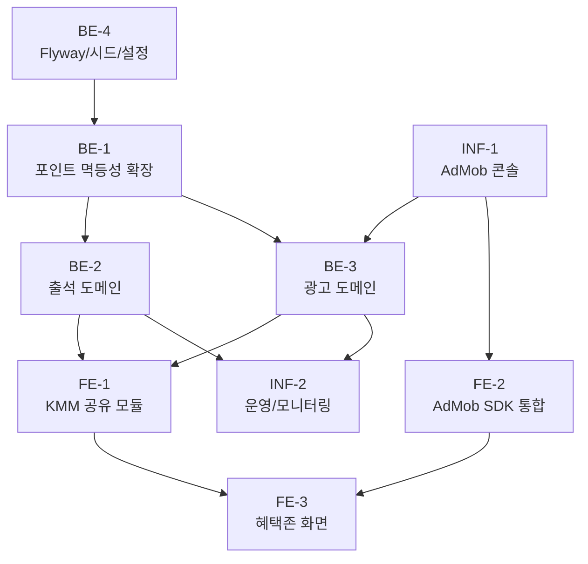

# 혜택존(Reward) Phase 1 — 작업 체크리스트

> Source spec: `docs/features/reward/spec.md`

## Back-End

### BE-1. 포인트 도메인 멱등성 확장 (공통 선결)

- [ ] `domain/point/` 아래 `PointTransaction` 엔티티(ledger 테이블)와 Repository 추가
- [ ] `UserPointService.recordTransaction(userId, delta, reason, idempotencyKey)` 메서드 추가
- [ ] 동일 `idempotencyKey` 재호출 시 기존 트랜잭션을 그대로 반환 (중복 적립 방지)
- [ ] 음수 잔액 거부 정책 (delta < 0이고 잔액 부족 시 `INSUFFICIENT_COIN`)
- [ ] Kotest 단위 테스트: 정상 적립 / 중복 키 / 잔액 부족 / 동시 호출 경합

### BE-2. 출석 도메인 (`domain/attendance/`)

- [ ] `AttendanceLog`, `AttendanceReward`(시드) 엔티티 정의
- [ ] `AttendanceService.checkIn(userId, todayKst)` 구현
  - [ ] 중복 일자 거부 → `ALREADY_CHECKED_IN`
  - [ ] 연속 일차 계산 (전일 출석 여부에 따라 +1 또는 1로 리셋)
  - [ ] 누적 일차 기반 보상 lookup + 보너스 1회 지급 가드
  - [ ] `UserPointService.recordTransaction(key="attendance:{userId}:{date}")` 호출
- [ ] `AttendanceService.getMonthly(userId, year, month)` 구현
- [ ] `AttendanceController` (`POST /api/attendance/check-in`, `GET /api/attendance/me`)
- [ ] Kotest 테스트: 첫 출석 / 중복 / 연속 증가 / 끊김 리셋 / 7·14·30일 부가 보상 / 31일+ 재진입

### BE-3. 광고 도메인 (`domain/ad/`)

- [ ] `AdRewardLedger` 엔티티 (`nonce` unique, status, reason, callback_payload JSON)
- [ ] `AdMobSsvVerifier`: query string parsing + AdMob 공개키 캐시 + ECDSA 서명 검증
- [ ] `AdRewardService.grantFromSsv(callback)` (서명 → 한도 → 멱등성 적립)
- [ ] `AdController` (`POST /api/ads/ssv/admob`, `GET /api/ads/reward/quota`)
- [ ] Kotest + TestContainers 테스트: 서명 성공/실패 / 한도 초과 / nonce 중복 / 알 수 없는 key id

### BE-4. 설정 및 마이그레이션

- [ ] `application.yml`에 `reward.admob.daily-limit`, `reward.admob.public-keys-url`, `reward.admob.reward-coin` 추가
- [ ] Flyway 마이그레이션 (dev H2 + prod MySQL): `point_transaction`, `attendance_log`, `attendance_reward`, `ad_reward_ledger`
- [ ] 시드 데이터 SQL: 출석 보상 테이블 (Phase 1 종자값 — spec 부록 표)

## Front-End

### FE-1. KMM 공유 모듈

- [ ] `shared/rewards/` 모듈 신설: Repository 인터페이스 + DTO
- [ ] Ktor 클라이언트로 attendance / quota API 바인딩
- [ ] `expect class AdMobRewardedAd` 선언 (commonMain)
- [ ] `expect class UuidGenerator`로 nonce 생성

### FE-2. AdMob SDK 통합

- [ ] Android: `play-services-ads` 통합 + `AdMobRewardedAd` androidMain 구현
- [ ] iOS: `Google-Mobile-Ads-SDK` 통합 + `AdMobRewardedAd` iosMain 구현 (CocoaPods 또는 SPM)
- [ ] `custom_data`에 `{userId, nonce}` JSON 주입
- [ ] 광고 종료 후 콜백에서 quota 재조회 트리거

### FE-3. 혜택존 화면

- [ ] `feature/rewards`를 혜택존 탭으로 재구성 (BottomNav 라벨/아이콘 갱신)
- [ ] `AttendanceWidget` Composable (월간 캘린더 + [출석 도장 찍기] + 보상 토스트)
- [ ] `RewardAdWidget` Composable ([지금 시청] + 잔여 횟수 + 한도 도달 시 비활성)
- [ ] `RewardZoneViewModel`: 초기 로드 + 도장/광고 시청 후 상태 갱신
- [ ] Compose Preview + UI 단위 테스트 (`composeTest`)

## Infra

### INF-1. AdMob 콘솔

- [ ] AdMob 콘솔 광고 단위 생성 (Android/iOS 각 1개)
- [ ] SSV URL 등록: dev / prod (`https://api.../api/ads/ssv/admob`)
- [ ] 테스트 디바이스 등록 (개발자 단말)
- [ ] AdMob 광고 단위 ID를 dev/prod application secret에 주입

### INF-2. 운영 / 모니터링

- [ ] AdMob 공개키 fetch 실패 시 폴백/알람 정책
- [ ] `ad_reward_ledger.status=REJECTED` 비율 알람 (rate > 임계값)
- [ ] `point_transaction` 잔액 sanity 체크 배치 (음수 잔액 탐지)

## 작업 흐름 (Workflow)

선행 관계 요약:

- `BE-1`은 본 spec과 Shop spec 모두의 선결 조건 → 가장 먼저 시작.
- `BE-3`(광고)는 AdMob 콘솔 SSV URL이 먼저 잡혀야 통신 검증이 가능 → `INF-1` 선행.
- 프론트 화면(`FE-3`)은 백엔드 두 도메인(`BE-2`, `BE-3`)과 AdMob SDK(`FE-2`)가 모두 준비된 뒤 결합.
