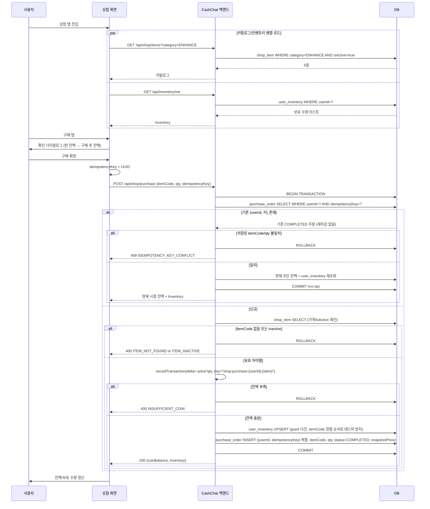

# 상점(Shop) Phase 1 — 강화재료 카탈로그 · 구매 · 인벤토리 기술 설계

> 상태: Draft
> 범위: Phase 1 (강화재료 카탈로그 + 구매 트랜잭션 + Inventory 적재)
> 관련 기획: [Confluence — 상점](https://moneyfactoryslave.atlassian.net/wiki/spaces/FCTC/pages/15007848), [Confluence — overview](https://moneyfactoryslave.atlassian.net/wiki/spaces/FCTC/pages/14975052/Cash+Chat+-+overview), `docs/planning/03-shop.md`
> 선결 조건: `docs/features/reward/spec.md`의 `BE-1 포인트 멱등성 확장` 완료

## 목표 (Goal)

상점 탭의 Phase 1로 강화재료 카탈로그를 노출하고, 코인 차감과 Inventory 적재가 원자적으로 묶인 구매 트랜잭션을 제공한다.

- 강화재료 5종(진화석×1 / 진화석×5 / 확률 부적 / 보호권 / 강화 패키지)을 시드 데이터로 노출
- 구매 시 코인 차감과 Inventory 적재가 같은 DB 트랜잭션 안에서 수행됨
- 동일 클라이언트가 동일 `idempotencyKey`로 재시도해도 중복 차감/적재가 없음
- Inventory의 **소비(consume)** 는 본 spec의 범위 외이며, 후속 진화 시스템 spec이 본 spec이 정의한 Inventory 모델을 read/consume 한다

## 유저 스토리 · 인수 조건

> 이 기능의 **유저 스토리와 관찰 가능한 인수 조건(검증 기준선)** 은 도메인 카탈로그가 단일 소유한다(SSOT):
> - [US-SHOP-001 강화재료 카탈로그 조회](../../domains/shop/US-SHOP-001-enhance-catalog.md)
> - [US-SHOP-002 코인으로 아이템 구매](../../domains/shop/US-SHOP-002-coin-purchase.md)
> - [US-SHOP-003 인벤토리 조회](../../domains/shop/US-SHOP-003-inventory.md)
>
> 본 문서는 그 계약을 만족시키는 **백엔드 구현 상세**(API 계약·데이터 흐름·트랜잭션 불변식·시퀀스)를 담는다.

## 구현 불변식 (Design Invariants)

관찰 가능한 AC는 위 US 파일이 소유하고, 아래는 그것을 보장하는 백엔드 구현 규칙이다.

- **구매는 단일 DB 트랜잭션** — 코인 차감(`recordTransaction`, 멱등키 `shop:purchase:{userId}:{idem}`) + `user_inventory` 다건 UPSERT + `purchase_order(COMPLETED)` INSERT를 원자적으로. 패키지 grant도 같은 트랜잭션.
- **멱등성 스코프 = `(userId, idempotencyKey)` 복합 UNIQUE.** 동일 키 재호출은 추가 차감 없이 **현재 시점** 잔액·인벤토리 반환(이중 차감만 방지). 같은 사용자·같은 키·다른 itemCode/qty → `409 IDEMPOTENCY_KEY_CONFLICT`. 다른 사용자의 같은 키 값은 별개 주문(키 선점·교차 노출 불가).
- **전역 락 순서**: `point`(`SELECT … FOR UPDATE`) → `user_inventory`(UPSERT, `itemCode` 오름차순) → `purchase_order`(INSERT). 잔액은 락 획득 후 검증(음수 방지), 다건 UPSERT는 정렬로 데드락 방지. 교차 도메인 트랜잭션도 이 순서 준수.
- **동시 INSERT 경합**: 같은 `(userId, idem)` 동시 요청은 복합 UNIQUE로 한쪽만 성공, 패자는 제약 위반을 catch해 **`@Transactional` 경계 바깥(별도 트랜잭션)** 에서 커밋된 주문 재조회 → 멱등 경로 처리(500 미노출).
- **거절 분기**: 잔액 부족 → `INSUFFICIENT_COIN`(포인트 레이어 402를 상점이 catch→변환), 미존재 itemCode → `ITEM_NOT_FOUND`, 비활성 → `ITEM_INACTIVE`(카탈로그에도 미노출). 어느 경우도 상태 무변화(롤백).
- Inventory **소비(consume)** 는 범위 외 → Evolution 도메인.

## API 계약

### 공통 규칙

- **인증**: 모든 endpoint는 `Authorization: Bearer <jwt>` 필수 (기존 `domain/auth` 발급 access token; 추가 scope 요구 없음). 누락·만료 시 `401 UNAUTHORIZED`, 권한 부족 시 `403 FORBIDDEN` — **이 인증/인가 응답은 아래 도메인 에러 공통 본문(`{code, message}`)을 따르지 않고**, 기존 Spring Security 기본 에러 형식(`{ "timestamp", "status", "error", "path" }`, `SecurityConfig`의 `sendError`)을 그대로 사용한다.
- **도메인 에러 응답 공통 본문**: 상점/인벤토리 도메인 에러는 `{ "code": "<DOMAIN_ENUM>", "message": "<설명>" }`(공통 `ErrorResponse`). 도메인 enum은 인수 기준에 명시된 식별자(`INSUFFICIENT_COIN` 등)와 1:1 일치. (인증/인가 401·403은 위 항목 참조 — 별도 형식)
- **idempotencyKey**: UUID v4 권장 (서버는 형식만 검증). 클라이언트가 같은 요청에 같은 키를 재사용하면 멱등 처리.
- **멱등성 스코프**: 멱등성 키는 `(userId, idempotencyKey)` **복합 유니크**로 사용자별로 격리한다. `point_transaction` 멱등성 키도 `shop:purchase:<userId>:<idem>`로 사용자 스코프를 부여해(기존 `attendance:<userId>:<date>` 컨벤션과 동일) 두 레이어 스코프를 일치시킨다 — 키 선점(squatting)·교차 사용자 정보노출을 구조적으로 차단한다.
- **동시성**: 같은 사용자의 동시 구매(서로 다른 키 포함)는 `UserPointService`가 포인트 행에 비관적 락(`SELECT … FOR UPDATE`)을 걸고 **락 획득 후** 잔액을 검증하므로 직렬화되어 잔액 음수가 발생하지 않는다. `user_inventory` 다건 UPSERT(패키지 grant)는 항상 `itemCode` 오름차순으로 정렬해 락 순서를 고정함으로써 동시 요청 간 데드락을 방지한다.
- **전역 락 획득 순서**: 트랜잭션 내 테이블 락은 `point`(`SELECT … FOR UPDATE`) → `user_inventory`(UPSERT) → `purchase_order`(INSERT) 순서로 고정한다. 향후 진화/소모(consume) 등 다른 도메인 트랜잭션도 **반드시 이 전역 순서**를 따라 락을 획득해야 교차 도메인 데드락(예: 한쪽은 `Inventory→Point`, 다른 쪽은 `Point→Inventory`)을 방지할 수 있다.

### 엔드포인트 요약

| Method | Path | 설명 |
| ------ | ---- | ---- |
| `GET`  | `/api/shop/items?category=ENHANCE` | 카탈로그 (Phase 1은 ENHANCE만 활성) |
| `POST` | `/api/shop/purchase` | `{itemCode, qty, idempotencyKey}` → 트랜잭션 구매 |
| `GET`  | `/api/inventory/me` | 보유 아이템 수량 리스트 |

### `GET /api/shop/items?category=<CATEGORY>`

ENHANCE (Phase 1 활성):

```json
{
  "category": "ENHANCE",
  "phase1Active": true,
  "items": [
    { "itemCode": "ENHANCE_PACK",    "name": "강화 패키지", "priceCoin": 1200, "effectSummary": "진화석 5 + 확률 부적 1 (묶음)",     "displayOrder": 5 },
    { "itemCode": "EVO_STONE",       "name": "진화석",      "priceCoin": 200,  "effectSummary": "진화 시도 1회 필요 재료",          "displayOrder": 10 },
    { "itemCode": "EVO_STONE_BUNDLE", "name": "진화석 ×5",  "priceCoin": 900,  "effectSummary": "묶음 구매 (10% 할인)",             "displayOrder": 20 },
    { "itemCode": "LUCK_CHARM",      "name": "확률 부적",   "priceCoin": 500,  "effectSummary": "다음 진화 시도 성공 확률 +10%p (1회용)", "displayOrder": 30 },
    { "itemCode": "PROTECT_TICKET",  "name": "보호권",      "priceCoin": 800,  "effectSummary": "실패 시 소비 코인 50% 반환 (1회용)",   "displayOrder": 40 }
  ]
}
```

COSMETIC / VOUCHER (Phase 1 비활성, "Phase 1 비대상 카테고리 호출" criterion 참조):

```json
{
  "category": "COSMETIC",
  "phase1Active": false,
  "items": []
}
```

| 에러 | HTTP | 비고 |
| ---- | ---- | ---- |
| `INVALID_CATEGORY` | 400 | enum 범위 밖 `category` 값 |

### `POST /api/shop/purchase`

Request: `{ "itemCode": "...", "qty": 1, "idempotencyKey": "<uuid>" }`

성공 응답:

```json
{
  "purchaseOrderId": 123,
  "status": "COMPLETED",
  "coinBalance": 1050,
  "inventory": [
    { "itemCode": "EVO_STONE", "qty": 3 }
  ]
}
```

> 멱등성 재호출은 추가 차감 없이 **현재 시점의 잔액·인벤토리를 재조회**해서 반환한다 — `idempotencyKey`는 *이중 차감 방지*만 보장하며, 첫 구매 이후 다른 거래(출석·광고 보상 등)가 있었다면 그 결과가 반영된 최신 값이 반환된다(stale 스냅샷으로 클라이언트 상태를 덮어쓰지 않기 위함). 조회는 `(userId, idempotencyKey)` 복합 키로 하며, **같은 사용자**가 같은 키를 **다른 `itemCode`/`qty`**로 재사용하면 `IDEMPOTENCY_KEY_CONFLICT`로 거부한다. 자세한 시맨틱은 인수 기준 "멱등성 — 동일 키 재호출" / "멱등성 — 키 재사용 충돌 (동일 사용자)" 참조.
>
> **동시 INSERT 경합**: 같은 `(userId, idempotencyKey)`로 거의 동시에 들어온 두 요청이 둘 다 선조회를 통과해 INSERT가 경합하면, 복합 유니크 제약으로 한쪽만 성공하고 패자는 제약 위반(`DataIntegrityViolationException`)을 받는다. 이를 catch해 커밋된 주문을 재조회한 뒤 **위와 동일한 멱등 경로**로 처리한다(payload 일치 → 현재 상태 반환, 불일치 → `IDEMPOTENCY_KEY_CONFLICT`) — 클라이언트에 `500`이 노출되지 않는다. **단, 이 catch·재조회는 반드시 `@Transactional` 경계 바깥(Facade/Controller)에서 수행한다**: 제약 위반이 발생한 트랜잭션은 Spring이 `rollback-only`로 마킹하므로 같은 트랜잭션 안에서 복구를 시도하면 커밋 시점에 `UnexpectedRollbackException`이 발생한다 → 트랜잭션이 정상 롤백된 뒤 **별도(신규) 트랜잭션**으로 최신 주문을 재조회해야 한다.

| 에러 | HTTP | 발생 조건 |
| ---- | ---- | -------- |
| `INSUFFICIENT_COIN` | 400 | 잔액 < `priceCoin * qty` (포인트 레이어 `InsufficientPointsException`/402를 Shop이 catch→변환, 아래 주 참조) |
| `ITEM_NOT_FOUND` | 400 | 시드에 없는 `itemCode` |
| `ITEM_INACTIVE` | 400 | `shop_item.isActive=false` |
| `VALIDATION` | 400 | `qty < 1`, `idempotencyKey` 형식 위반 등 |
| `IDEMPOTENCY_KEY_CONFLICT` | 409 | **같은 사용자**가 같은 `idempotencyKey`를 다른 `itemCode`/`qty`로 재사용 (멱등성 스코프 = `(userId, idempotencyKey)`) |

> **`INSUFFICIENT_COIN` 변환 주**: 잔액 부족은 `UserPointService.recordTransaction`이 던지는 `InsufficientPointsException`으로 발생한다. 포인트 레이어의 기본 매핑은 `402 INSUFFICIENT_POINTS`(`PointExceptionHandler`)지만, **`ShopPurchaseService`가 이를 catch해 상점 도메인 에러 `INSUFFICIENT_COIN`(400)으로 변환**한다 — 상점 API는 코인 도메인 언어로 일관 응답하고 프론트의 `INSUFFICIENT_COIN` 매핑(FE-3)을 유지한다.

### `GET /api/inventory/me`

```json
{
  "items": [
    { "itemCode": "EVO_STONE",      "qty": 2 },
    { "itemCode": "PROTECT_TICKET", "qty": 1 }
  ]
}
```

도메인 에러 없음. 인증 실패 시 `401`만 발생한다 — 현 보안 설정이 `anyRequest().authenticated()`(리소스별 인가/역할 단계 없음) + CSRF 비활성이라 인증된 요청에는 `403`이 트리거되지 않는다(공통 규칙의 401/403 중 본 엔드포인트는 401만 해당). 응답 형식은 공통 규칙의 Spring Security 기본 형식(`{ "timestamp", "status", "error", "path" }`)을 따른다.

## 사용자 흐름 (User Flow)

1. 사용자가 상점 탭(세그먼트: [강화재료] / [외형](disabled) / [교환권](disabled))을 열고 [강화재료]를 선택한다.
2. 프론트가 `GET /api/shop/items?category=ENHANCE`와 `GET /api/inventory/me`를 병렬 호출한다.
3. 카드 리스트로 5종 아이템과 보유 수량, 코인 잔액을 보여준다.
4. 사용자가 [구매]를 누르면 확인 다이얼로그가 뜬다 ("현재: 🪙1,250 → 구매 후: 🪙1,050").
5. 사용자가 [구매 확정]을 누르면 프론트가 UUID `idempotencyKey`를 생성하여 `POST /api/shop/purchase`를 호출한다.
6. 백엔드가 단일 트랜잭션으로 코인 차감 + Inventory 적재를 수행하고 결과를 응답한다.
7. 프론트가 코인 잔액과 보유 수량을 갱신한다. 코인 부족 시 [🎁 혜택존에서 코인 벌기 →] 배너로 딥링크한다.

### 순차 흐름도 (Sequence Diagram)



## 도메인 enum 정의

### `PurchaseOrder.status`

| 값 | 의미 |
| -- | ---- |
| `COMPLETED` | 트랜잭션 커밋 성공. **Phase 1에서 `purchase_order` 행이 가지는 유일한 값.** 도메인/잔액/inactive 거부는 `purchase_order` 행이 만들어지기 전 `ROLLBACK` 되므로 행이 남지 않는다. |
| `FAILED` | 예약값. 사후 보상 트랜잭션(예: 다운스트림 grant 적재 실패 → 코인 환불) 실패 시 마킹용. Phase 1 미사용 (별도 spec). 모니터링 훅(`tasks: INF-2`)은 이 값을 0이 정상으로 가정한다. |

> 운영 알람은 이 enum을 단일 source of truth로 참조한다. 신규 status 값 도입은 별도 spec 결정 후 본 표를 갱신한 뒤에만 추가한다.

## 범위 외 (Out Of Scope)

- **외형 아이템 탭**: 스킨/액세서리/배경, IAP 결제 — Phase 2
- **네이버페이 교환권 탭**: `domain/voucher`, `domain/kyc`, `domain/abuse` — 별도 spec
- **강화 패키지 24h 한정 노출(FOMO) 정책**: `validUntil` 같은 시간 제한 노출 룰은 별도 spec. 본 spec은 `ENHANCE_PACK`을 상시 노출.
- **진화/강화 시스템**: `domain/evolution`, `Inventory.consume(itemCode, qty)` — Evolution spec이 본 spec의 Inventory 모델을 read/consume
- **운영자 상품 관리 UI**: `shop_item`은 Flyway 마이그레이션 또는 별도 DB 작업으로만 관리
- **묶음 할인 / 정가 표시 / 할인율 UI 메타**: Phase 1은 단일 `priceCoin`만 노출 (진화석×5는 `priceCoin=900`으로 시드)
- **환불 / 결제 취소**: 구매 후 코인 환불 흐름은 미지원
- **결제 한도 / 어뷰징 방지**: 본 spec은 멱등성과 잔액 검증만 책임 (한도/어뷰징은 교환권 spec과 함께)
- **재료 효과 감산 로직**: 기획안의 "Lv4 이상 시 확률 부적 +5%p로 감산" 같은 사용 시점 효과 조정은 Inventory consume 단계의 정책이며 Evolution spec이 다룬다. 본 spec의 `effectSummary`는 기본 효과만 기재한다.

## 부록: Phase 1 시드값

### `shop_item` 테이블 시드 (Phase 1)

| itemCode         | name        | category | priceCoin | effectSummary                              | isActive | displayOrder |
| ---------------- | ----------- | -------- | --------- | ------------------------------------------ | -------- | ------------ |
| `ENHANCE_PACK`   | 강화 패키지 | ENHANCE  | 1,200     | 진화석 5 + 확률 부적 1 (묶음)              | true     | 5            |
| `EVO_STONE`      | 진화석      | ENHANCE  | 200       | 진화 시도 1회 필요 재료                    | true     | 10           |
| `EVO_STONE_BUNDLE`    | 진화석 ×5   | ENHANCE  | 900       | 묶음 구매 (10% 할인)                        | true     | 20           |
| `LUCK_CHARM`     | 확률 부적   | ENHANCE  | 500       | 다음 진화 시도 성공 확률 +10%p (1회용)      | true     | 30           |
| `PROTECT_TICKET` | 보호권      | ENHANCE  | 800       | 실패 시 소비 코인 50% 반환 (1회용)          | true     | 40           |

### `shop_item_grant` 시드 (다건 grant join 테이블)

| itemCode         | grantItemCode    | grantQty |
| ---------------- | ---------------- | -------- |
| `EVO_STONE`      | `EVO_STONE`      | 1        |
| `EVO_STONE_BUNDLE`    | `EVO_STONE`      | 5        |
| `LUCK_CHARM`     | `LUCK_CHARM`     | 1        |
| `PROTECT_TICKET` | `PROTECT_TICKET` | 1        |
| `ENHANCE_PACK`   | `EVO_STONE`      | 5        |
| `ENHANCE_PACK`   | `LUCK_CHARM`     | 1        |

- 단건 아이템도 일관된 처리 경로를 위해 `shop_item_grant`에 자기 자신 grant 1행을 시드한다.
- `displayOrder`는 작을수록 상단 노출 — 패키지를 최상단에 배치.
- **itemCode 명명 규칙**: `itemCode`는 식별자일 뿐 수량을 의미하지 않는다 (`EVO_STONE_BUNDLE`은 "묶음"을 뜻하는 라벨이며 실제 지급 수량은 항상 `shop_item_grant.grantQty`가 단일 source of truth). 향후 묶음 수량 조정이 발생하면 시드 행만 수정하고 `itemCode`는 유지한다.
