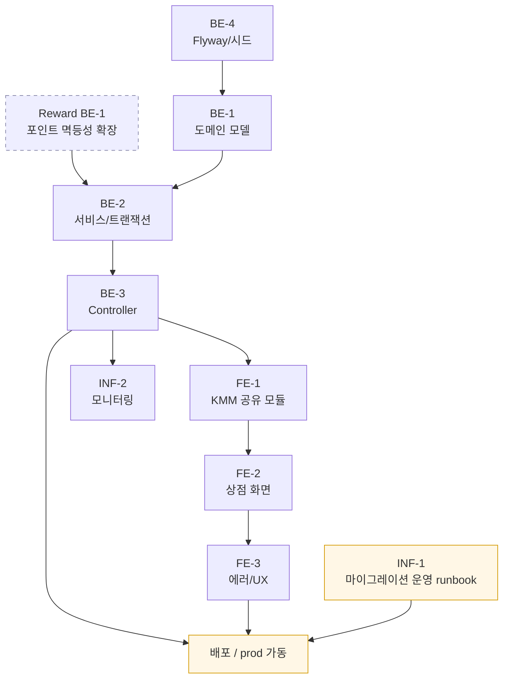

# 상점(Shop) Phase 1 — 작업 체크리스트

> Source spec: `docs/features/shop/spec.md`
> 선결 조건: `docs/features/reward/tasks.md`의 `BE-1 포인트 멱등성 확장` 완료

## Back-End

### BE-1. 도메인 모델 (`domain/shop/`, `domain/inventory/`)

- [ ] `ShopItem` 엔티티 (`itemCode` PK, `name`, `category`, `priceCoin`, `isActive`, `displayOrder`)
- [ ] `ShopItemGrant` 조인 엔티티 (`itemCode`, `grantItemCode`, `grantQty`) — 패키지 지원
- [ ] `PurchaseOrder` 엔티티 (`(userId, idempotencyKey)` **복합 unique**, `itemCode`, `qty`, `status`, `snapshotPrice`, `createdAt`) — 멱등성 스코프를 사용자별로 격리(키 선점·교차 사용자 오용 차단). 재호출 시 저장된 `itemCode`/`qty`가 요청과 일치하는지 검증(불일치 → `IDEMPOTENCY_KEY_CONFLICT`)
- [ ] `UserInventory` 엔티티 (`userId`, `itemCode`, `qty`) — composite unique
- [ ] Repository: JPA + 동시성 안전 UPSERT (MySQL `ON DUPLICATE KEY UPDATE` / H2 `MERGE`) — 다건 UPSERT는 `itemCode` 오름차순 정렬 후 처리(락 순서 고정 → 데드락 방지)
- [ ] Inventory read API와 후속 `consume` 확장 지점을 위한 인터페이스 분리

### BE-2. 서비스 / 트랜잭션

- [ ] `ShopCatalogService.listItems(category)` — `isActive=true` 필터 + `displayOrder` 정렬
- [ ] `ShopPurchaseService.purchase(userId, itemCode, qty, idempotencyKey)`
  - [ ] 멱등성 선조회 (`WHERE userId=? AND idempotencyKey=?`) → 기존 `COMPLETED` 주문이면: 저장된 `itemCode`/`qty`가 요청과 일치하는지 검증(불일치 시 `IDEMPOTENCY_KEY_CONFLICT`) → 재차감 없이 **현재 시점**의 잔액·인벤토리를 재조회해 반환 (stale 스냅샷 미반환)
    - 동시 INSERT 경합(같은 `(userId, key)` 더블클릭 등 — 둘 다 선조회 통과): `purchase_order` 복합 유니크 제약으로 한쪽이 `DataIntegrityViolationException`을 받음 → **`@Transactional` 경계 바깥(Facade/Controller)에서 catch**(실패 트랜잭션은 `rollback-only` 마킹 → 내부에서 복구하면 커밋 시 `UnexpectedRollbackException`) → 트랜잭션 롤백 후 **별도 트랜잭션**으로 커밋된 주문을 재조회해 위 멱등 경로 처리(일치 → 현재 상태 반환, 불일치 → `IDEMPOTENCY_KEY_CONFLICT`/409). 클라이언트에 `500` 미노출.
  - [ ] `@Transactional` 안에서 `UserPointService.recordTransaction(delta=-price*qty, key="shop:purchase:{userId}:{idem}")` 호출 — 포인트 키도 사용자 스코프를 부여해 `purchase_order` 복합 키와 스코프 일치(기존 `attendance:{userId}:{date}` 컨벤션과 동일)
    - 참고: `UserPointService`는 외부 API가 아니라 **동일 백엔드·동일 DB의 로컬 `@Service`**(propagation=REQUIRED)로 호출자 트랜잭션에 합류 → 코인 차감·인벤토리 적재가 단일 DB 트랜잭션으로 원자 처리됨. 기존 `AttendanceService.checkIn`과 동일 패턴이라 분산 트랜잭션/Outbox·Saga 불필요.
    - 동시성: `recordTransaction`은 포인트 행에 비관적 락(`findByUserIdForUpdate` = `SELECT … FOR UPDATE`)을 걸고 **락 후** 잔액을 검증하므로, 같은 사용자의 동시 구매(서로 다른 키 포함)가 직렬화되어 잔액 음수가 발생하지 않는다.
    - 전역 락 순서 `point`(FOR UPDATE) → `user_inventory`(UPSERT) → `purchase_order`(INSERT)를 지키며, 타 도메인(진화/소모)도 동일 순서를 준수한다(spec "공통 규칙 — 전역 락 획득 순서" 참조).
  - [ ] `INSUFFICIENT_COIN`, `ITEM_INACTIVE`, `ITEM_NOT_FOUND`, `IDEMPOTENCY_KEY_CONFLICT` 도메인 에러 분리
    - `InsufficientPointsException`(포인트 레이어 기본 매핑 `402 INSUFFICIENT_POINTS`)을 catch해 상점 도메인 에러 `INSUFFICIENT_COIN`(400)으로 변환 — 상점 API는 코인 도메인 언어로 일관 응답
  - [ ] `shop_item_grant` 다건 적재 (`ENHANCE_PACK` 같은 패키지) — `itemCode` 오름차순 정렬 후 순차 UPSERT로 데드락 방지
- [ ] `InventoryService.getMine(userId)`
- [ ] Kotest + TestContainers 테스트: 정상 / 잔액 부족 / 비활성 / 멱등성 재호출(현재 상태 반환) / 키 재사용 충돌 / 패키지 다건 grant / 동시 구매 경합

### BE-3. Controller

- [ ] `ShopController` (`GET /api/shop/items`, `POST /api/shop/purchase`)
- [ ] `InventoryController` (`GET /api/inventory/me`)
- [ ] Request 검증: `qty >= 1`, `idempotencyKey` UUID 형식, `category` enum
- [ ] Phase 1 비대상 카테고리 처리 (`COSMETIC`, `VOUCHER` → 빈 배열 + `phase1Active:false`)
- [ ] Web 테스트: 200 / 400 / 도메인 에러 매핑

### BE-4. 마이그레이션 / 시드

- [ ] Flyway 마이그레이션 (dev H2 + prod MySQL): `shop_item`, `shop_item_grant`, `purchase_order`, `user_inventory` — `purchase_order`에 `(user_id, idempotency_key)` 복합 unique 인덱스, `user_inventory`에 `(user_id, item_code)` 복합 unique 인덱스 포함
- [ ] Phase 1 시드 SQL: 5종 ENHANCE 아이템 + `shop_item_grant` 6행 (spec 부록 표)

## Front-End

### FE-1. KMM 공유 모듈

- [ ] `shared/shop/` Repository + DTO (Ktor)
- [ ] `shared/inventory/` Repository + DTO
- [ ] 공통 `UuidGenerator` (`expect`/`actual`)로 `idempotencyKey` 생성

### FE-2. 상점 화면

- [ ] `feature/shop`을 세그먼트 탭으로 재구성 — [강화재료] active / [외형](disabled) / [교환권](disabled)
- [ ] `ShopItemCard` Composable (보유 수량 배지, 가격, [구매] 버튼)
- [ ] 구매 확인 다이얼로그 (현재 → 구매 후 잔액 미리보기)
- [ ] 코인 부족 시 sticky footer (혜택존 딥링크)
- [ ] `ShopViewModel`: 카탈로그+인벤토리 병렬 로드, 구매 후 상태 갱신
- [ ] UI 단위 테스트 + Compose Preview

### FE-3. 에러 / UX

- [ ] `INSUFFICIENT_COIN` → 토스트 + footer 강조
- [ ] `ITEM_INACTIVE` / `ITEM_NOT_FOUND` → 카탈로그 강제 재로드
- [ ] 멱등성 키 보존 자동 재시도 정책
  - 재시도 대상: 요청 timeout / DNS·TCP 연결 실패 / HTTP 5xx (응답 본문 무관)
  - 제외: HTTP 4xx, 도메인 에러(`INSUFFICIENT_COIN`/`ITEM_NOT_FOUND`/`ITEM_INACTIVE`), 200 OK
  - 최대 재시도 1회 (총 최대 2회 시도) — 동일 `idempotencyKey` 보존
  - 백오프: 500ms 고정 지연 후 1회 재시도 (Phase 1은 단순화; 추후 지수 백오프 가능)
  - 관찰: 1차 실패와 재시도 결과를 `idempotencyKey`·HTTP status·소요시간과 함께 클라이언트 로그/이벤트에 기록
- [ ] 사용자가 동일 다이얼로그에서 이중 탭해도 1건만 발송 (debounce + 진행 중 가드)

## Infra

### INF-1. 마이그레이션 운영

- [ ] dev(H2)·prod(MySQL 8) 양쪽 Flyway 적용 검증
- [ ] 시드 데이터 prod 적용 절차 문서화 (Flyway repeatable vs 별도 seed task)
- [ ] 시드 변경 시 운영 절차 (rollout/rollback)

### INF-2. 모니터링

- [ ] `purchase_order.status=FAILED` 비율 알람 (정상치 = 0; spec "도메인 enum 정의 — `PurchaseOrder.status`" 참조)
- [ ] `INSUFFICIENT_COIN` 누적 분포 대시보드 (가격 정책 튜닝 근거)
- [ ] `user_inventory.qty` 음수 가드 (스키마 CHECK 또는 배치 점검)

## 작업 흐름 (Workflow)

선행 관계 요약:

- **외부 선결**: `Reward BE-1`(포인트 멱등성 확장)이 본 spec의 구매 트랜잭션에 필수 → 혜택존 spec과 코디네이션해서 한 번만 작업.
- **시드 → 모델 → 서비스 → 컨트롤러** 순서를 지켜야 통합 테스트가 깨지지 않음.
- 프론트(`FE-2`, `FE-3`)는 백엔드 컨트롤러(`BE-3`)가 dev 환경에 떠 있어야 통합 확인 가능.
- **INF-1은 배포 게이트**: 컨트롤러 구현·테스트가 INF-1을 기다리지 않는다 (구 다이어그램의 `INF1 → BE3` 의존성 제거). INF-1은 prod 배포 시점에 BE-3·FE-3와 함께 통과되어야 하는 운영 runbook.
