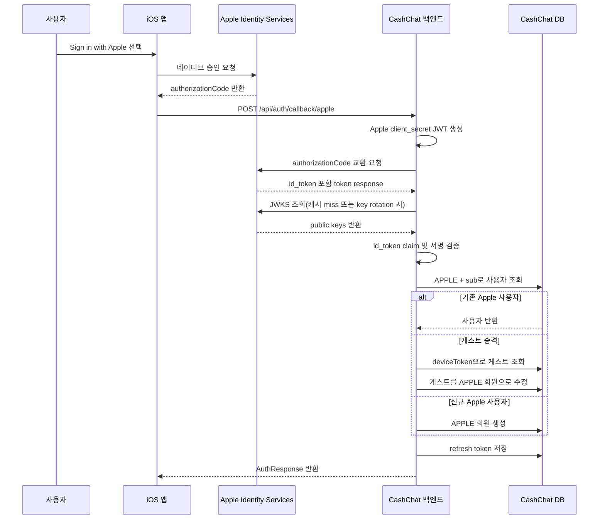

# Apple 소셜 로그인 백엔드 기술 설계

## 목표

CashChat iOS 앱에서 Sign in with Apple을 사용할 수 있도록 백엔드에 Apple 소셜 로그인 callback API를 추가한다.

iOS 앱은 Apple에서 발급받은 `authorizationCode`를 CashChat 백엔드로 전달한다. 백엔드는 Apple token endpoint에 직접 요청해 `id_token`을 받고, 해당 토큰의 서명과 claim을 검증한 뒤 기존 CashChat `accessToken`과 `refreshToken`을 발급한다.

이번 Spec은 백엔드 개발만 다룬다. iOS 화면, iOS SDK 연동, Android 지원 여부는 프론트엔드 담당 팀원이 별도로 결정한다.

## 유저 스토리 · 인수 조건

> 이 기능의 **유저 스토리와 관찰 가능한 인수 조건(검증 기준선)** 은 도메인 카탈로그가 단일 소유한다(SSOT): [US-AUTH-001 Apple 소셜 로그인(iOS)](../../domains/auth/US-AUTH-001-apple-social-login.md).
> 본 문서는 그 계약을 만족시키는 **백엔드 구현 상세**(API·백엔드 흐름·결정 기록·시퀀스)를 담는다.

## 구현 불변식 (Design Invariants)

관찰 가능한 AC는 위 US 파일이 소유하고, 아래는 그것을 보장하는 백엔드 구현 규칙이다(상세 배경은 아래 "결정 기록" 참조).

- **백엔드 code exchange 방식**: iOS가 넘긴 `authorizationCode`를 백엔드가 Apple token endpoint에 교환하고, 응답의 `id_token`(요청에 포함된 `identityToken`이 아니라)을 검증한다 — 서명·issuer·audience·expiration.
- **검증된 `sub` claim만 provider id로 신뢰**. 클라이언트가 전달한 provider id/email은 그대로 신뢰하지 않는다(위조 차단).
- **게스트 승격**: `deviceToken` 일치 + provider `NONE` + Apple 미연결이면 기존 게스트를 `APPLE` 회원으로 승격(신규 생성 아님)하고, 재사용 방지를 위해 `deviceToken`을 제거. 기존 Apple 사용자는 재로그인, 없으면 신규 생성.
- **실패 시 무변화**: token exchange 실패/`id_token` 무효(없음·만료·서명오류·audience 불일치)는 로그인 거부, 사용자 생성·수정 없음. 오류 응답에 Apple 원문·private key·client secret 미노출.
- Apple private key·Team ID·Key ID는 env/secret 주입(저장소 커밋 금지). Android/Web·계정 연결 해제·revoke 콜백은 범위 외.

## API 계약

### `POST /api/auth/callback/apple`

Request:

```json
{
  "authorizationCode": "apple-authorization-code",
  "identityToken": "optional-apple-id-token-from-ios",
  "fullName": "Optional User Name",
  "deviceToken": "optional-current-guest-device-token"
}
```

Response:

```json
{
  "accessToken": "cashchat-access-token",
  "refreshToken": "cashchat-refresh-token",
  "userId": 1,
  "role": "MEMBER"
}
```

참고:

- `authorizationCode`는 필수다.
- `deviceToken`은 선택값이며, 게스트 계정을 회원 계정으로 승격할 때 사용한다.
- `identityToken`은 선택값이다. 백엔드는 요청에 포함된 `identityToken`이 아니라 Apple token exchange 응답의 `id_token`을 기준으로 검증한다.
- `fullName`은 선택값이다. Apple은 사용자 이름을 최초 승인 시점에만 제공할 수 있으므로, 이름이 없으면 기존 저장값을 유지하거나 `Apple User` 같은 안정적인 기본값을 사용할 수 있다.

## 백엔드 흐름

1. 클라이언트가 Apple `authorizationCode`와 선택적 게스트 `deviceToken`으로 `POST /api/auth/callback/apple`을 호출한다.
2. 백엔드는 Apple Team ID, Key ID, client id, private key 설정을 사용해 Apple client secret JWT를 생성한다.
3. 백엔드는 Apple token endpoint에 authorization code 교환을 요청한다.
4. Apple은 `id_token`을 포함한 token response를 반환한다.
5. 백엔드는 Apple 공개키를 조회하거나 캐시에서 가져오고, token header의 `kid`에 맞는 key로 `id_token`을 검증한다.
6. 백엔드는 검증된 claim에서 Apple 사용자 정보를 추출한다.
   - provider id: `sub`
   - email: `email`이 존재할 때만 사용
   - email verification state: `email_verified`가 존재할 때만 사용
7. 백엔드는 provider `APPLE`로 기존 사용자 조회 또는 게스트 승격 또는 신규 회원 생성을 수행한다.
8. 백엔드는 필요한 경우 포인트를 초기화하고 CashChat 인증 토큰을 반환한다.

## 사용자 흐름(User Flow)

1. 사용자가 iOS 앱에서 Sign in with Apple을 누른다.
2. iOS 앱이 Apple 네이티브 승인 화면을 진행한다.
3. iOS 앱이 Apple `authorizationCode`를 받는다.
4. iOS 앱이 `authorizationCode`와 선택적 현재 게스트 `deviceToken`을 CashChat 백엔드로 보낸다.
5. CashChat 백엔드가 Apple과 통신해 사용자 신원을 검증한다.
6. CashChat 백엔드가 기존 Apple 사용자를 로그인시키거나 현재 게스트 사용자를 Apple 회원으로 승격한다.
7. iOS 앱이 CashChat 토큰을 저장하고 회원 세션으로 진입한다.

## 순차 흐름도(Sequence Diagram)



## 결정 기록(Decision Record)

### 맥락(Context)

CashChat은 이미 게스트 로그인과 Google OAuth 로그인을 지원한다. 현재 Google 로그인은 클라이언트가 전달한 authorization code를 백엔드가 Google에 교환하고, Google user info를 조회한 뒤 CashChat 토큰을 발급한다.

Apple 로그인은 iOS 앱에서 사용할 예정이며, Android 지원은 이번 기능에서 다루지 않는다. 또한 Apple은 Google처럼 별도 user info endpoint를 안정적으로 사용하는 방식이 아니므로, Apple token response의 `id_token` claim을 검증하고 사용자 정보로 사용해야 한다.

### 결정(Decision)

Apple 소셜 로그인은 백엔드 authorization code exchange 방식으로 구현한다.

iOS 앱은 Apple `authorizationCode`를 백엔드에 전달한다. 백엔드는 Apple token endpoint에 code를 교환하고, 반환된 `id_token`을 검증한다. 검증된 Apple `sub` claim을 CashChat provider id로 사용하고, 기존 사용자 등록, 게스트 승격, 포인트 초기화, 토큰 발급 흐름은 현재 Auth 도메인의 기존 방식을 최대한 재사용한다.

### 대안(Alternatives)

- iOS 앱이 전달한 `identityToken`만 백엔드에서 검증한다. 이 방식은 iOS 전용 앱에서 단순하고 흔히 쓰이지만, 현재 Google 로그인과 같은 code exchange 구조와는 거리가 있다.
- 클라이언트가 전달한 Apple provider id 또는 email을 그대로 신뢰한다. 구현은 가장 단순하지만 백엔드가 사용자 신원을 독립적으로 검증하지 못하므로 선택하지 않는다.
- Android 또는 Web까지 포함한 Apple 로그인 흐름을 함께 설계한다. 이번 기능은 백엔드와 iOS 사용을 우선하므로 범위에서 제외한다.

### 결과(Consequences)

- Google OAuth와 유사하게 provider authorization code를 백엔드가 직접 교환하는 구조를 유지한다.
- Apple private key, Team ID, Key ID, client secret JWT 생성이 백엔드 운영 책임에 포함된다.
- Apple `id_token` 서명 검증과 JWKS 처리 테스트가 필요하다.
- Apple private key는 민감 정보이므로 환경변수 또는 secret 관리 체계로 주입해야 하며, 저장소에 커밋하면 안 된다.

## 범위를 벗어난 항목(Out Of Scope)

- iOS UI, iOS SDK 연동, Apple authorization code 획득 구현.
- Android Apple 로그인 지원.
- Web Apple 로그인 지원.
- Apple 계정 연결 해제.
- Apple credential revoke callback 또는 주기적 계정 상태 점검.
- 기존 Google 사용자와 Apple 사용자 계정 병합.
- 동일 email을 가진 서로 다른 provider 계정의 수동 병합.
- 로그인 목적을 넘어 Apple refresh token을 저장하거나 장기 Apple API 접근에 사용하는 기능.
