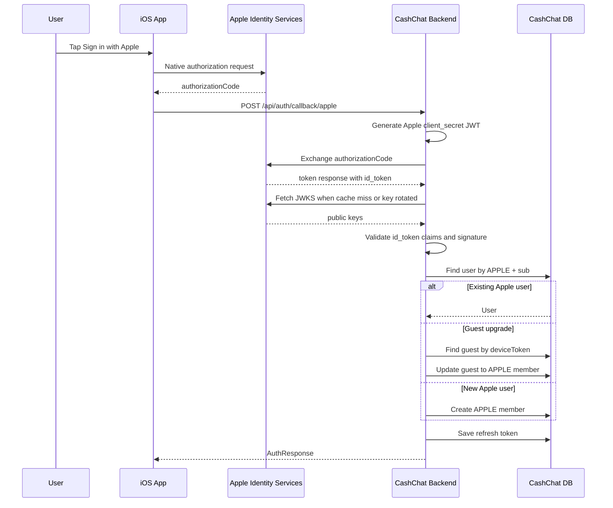

# Apple Social Login Backend Design

## Goal

CashChat iOS 앱에서 Sign in with Apple을 사용할 수 있도록 백엔드에 Apple 소셜 로그인 callback API를 추가한다. iOS 앱은 Apple에서 받은 authorization code를 백엔드에 전달하고, 백엔드는 Apple token endpoint와 직접 통신해 `id_token`을 검증한 뒤 기존 CashChat JWT/refresh token을 발급한다.

이번 스펙은 백엔드 개발 범위만 다룬다. iOS 화면, iOS SDK 연동, Android 지원 여부는 프론트엔드 담당 팀원이 별도로 결정한다.

## User Story

### Story 1: iOS 사용자의 Apple 로그인

As an iOS user, I want to sign in with my Apple account, so that I can convert my guest session into a member account or return to my existing CashChat member account.

### Story 2: 기존 게스트 계정 승격

As a guest user, I want my current guest session to become an Apple member account after social login, so that my existing guest-owned data and points can continue under the member account.

### Story 3: 백엔드의 인증 무결성 보장

As the CashChat backend, I want to validate the Apple authorization code and `id_token` with Apple-issued material, so that the server does not trust user identity claims supplied only by the client.

## Acceptance Criteria

### Successful Apple Login

Given an iOS app sends a valid Apple authorization code to the backend  
And Apple token endpoint returns an `id_token` for the configured CashChat Apple client id  
When the client calls `POST /api/auth/callback/apple`  
Then the backend validates the `id_token` signature, issuer, audience, and expiration  
And the backend returns `AuthResponse` with CashChat `accessToken`, `refreshToken`, `userId`, and `role=MEMBER`.

### Guest Upgrade

Given a guest user exists with the supplied `deviceToken`  
And the guest user has provider `NONE`  
And the Apple identity has not been linked to another CashChat user  
When the client calls `POST /api/auth/callback/apple` with that `deviceToken`  
Then the backend updates the guest user with provider `APPLE`, Apple provider id, optional email/name, and role `MEMBER`  
And the backend clears the device token from that user so guest login cannot reuse the same credential path.

### Existing Apple User Login

Given a CashChat user already exists with provider `APPLE` and the Apple `sub` claim  
When the client calls `POST /api/auth/callback/apple` with a valid authorization code for the same Apple identity  
Then the backend returns a new CashChat access token and refresh token for that existing user  
And the backend does not create a duplicate user.

### Token Exchange Failure

Given Apple rejects the authorization code, client secret, redirect uri, or client id  
When the backend exchanges the authorization code with Apple  
Then the backend returns an OAuth authentication error  
And the response does not expose Apple response bodies, private key material, or generated client secret values.

### Invalid Apple ID Token

Given Apple token exchange returns a missing, expired, incorrectly signed, or wrong-audience `id_token`  
When the backend validates the token  
Then the backend rejects the login  
And no user is created or updated.

### Non-Apple Platforms

Given an Android client or non-iOS client wants Apple login support  
When this backend spec is implemented  
Then no Android-specific Apple login flow is added  
And platform-specific UX decisions remain outside this backend scope.

## API Contract

### `POST /api/auth/callback/apple`

Request:

```json
{
  "authorizationCode": "apple-authorization-code",
  "identityToken": "optional-apple-id-token-from-ios",
  "fullName": "Optional User Name",
  "deviceToken": "optional-current-guest-device-token"
}
```

Response:

```json
{
  "accessToken": "cashchat-access-token",
  "refreshToken": "cashchat-refresh-token",
  "userId": 1,
  "role": "MEMBER"
}
```

Notes:

- `authorizationCode` is required.
- `deviceToken` is optional and enables guest-to-member upgrade.
- `identityToken` is optional in the request because the backend must use the `id_token` returned by Apple token exchange as the authoritative token.
- `fullName` is optional because Apple may only provide the user's name during the first authorization. If neither Apple claims nor request fields contain a name, the backend may use a stable fallback such as `Apple User`.

## Backend Flow

1. Client calls `POST /api/auth/callback/apple` with Apple authorization code and optional guest `deviceToken`.
2. Backend generates an Apple client secret JWT using configured Apple Team ID, Key ID, client id, and private key.
3. Backend posts the authorization code to Apple token endpoint.
4. Apple returns token response including `id_token`.
5. Backend fetches or reuses Apple public keys, selects the key by `kid`, and validates the `id_token`.
6. Backend extracts Apple user info from claims:
   - provider id: `sub`
   - email: `email` when present
   - email verification state: `email_verified` when present
7. Backend calls the existing user lookup/register flow with provider `APPLE`.
8. Backend initializes points if needed and returns CashChat auth tokens.

## User Flow

1. User taps Sign in with Apple in the iOS app.
2. iOS app completes Apple's native authorization prompt.
3. iOS app receives an authorization code.
4. iOS app sends the authorization code and optional current guest device token to CashChat backend.
5. CashChat backend verifies the identity with Apple.
6. CashChat backend logs in an existing Apple user or upgrades the current guest user.
7. iOS app stores CashChat tokens and enters the authenticated member session.

## Sequence Diagram



## Backend Components

### AuthController

Adds `POST /api/auth/callback/apple`, mirroring the existing Google callback endpoint.

### AppleOAuthCallbackRequest

Request DTO with validation for required `authorizationCode` and optional `identityToken`, `fullName`, and `deviceToken`.

### AuthProviderType

Adds `APPLE`.

### Apple Client Secret Generator

Generates the JWT client secret required by Apple token endpoint. It depends on Apple Team ID, Key ID, client id, and private key configuration. The private key must be provided through environment or secret management and must not be committed to the repository.

### Apple Token Client

Posts authorization code exchange requests to Apple token endpoint and maps token responses. Token exchange failures are wrapped in the existing OAuth exception path.

### Apple ID Token Validator

Validates Apple `id_token` by checking:

- Signature using Apple's JWKS.
- `iss` equals `https://appleid.apple.com`.
- `aud` equals the configured Apple client id.
- `exp` is in the future.
- `sub` is present.

### Apple User Info Extractor

Maps validated claims into the existing `OAuthUserInfo` model. The provider id is the Apple `sub` claim. Email may be absent after first authorization, so existing stored email should not be overwritten with null for returning users.

## Configuration

Add backend configuration for Apple OAuth:

- Apple registration name, for example `apple-app`.
- Apple client id, usually the iOS app bundle id or configured Services ID depending on Apple setup.
- Apple team id.
- Apple key id.
- Apple private key value or private key file path.
- Apple token endpoint: `https://appleid.apple.com/auth/token`.
- Apple JWKS endpoint: `https://appleid.apple.com/auth/keys`.
- Redirect uri if required by the selected Apple client configuration.

Secrets must be supplied via environment-specific configuration. Example files may include placeholder keys only.

## Error Handling

- Invalid request body returns validation error.
- Apple token exchange failure returns OAuth authentication error.
- Missing `id_token` returns OAuth authentication error.
- Invalid signature, issuer, audience, expiration, or missing `sub` returns OAuth authentication error.
- Logs may include provider name and high-level failure type, but must not include private key, generated client secret, full Apple token response, authorization code, or `id_token`.

## Testing Strategy

- Controller tests cover request validation and delegation to `AuthService`.
- Service tests cover successful Apple login, guest upgrade, existing user login, token exchange failure, invalid token failure, and missing optional profile fields.
- Unit tests cover Apple client secret JWT claims and headers without exposing key material.
- Unit tests cover Apple `id_token` validation with test keys.
- Existing Google login tests must continue passing to prove shared OAuth behavior is not regressed.

## Decision Record

### Context

CashChat already supports guest login and Google OAuth login. Current Google login receives an authorization code from the client, exchanges it with Google from the backend, fetches provider user info, then issues CashChat tokens. Apple login is needed for the iOS app only, while Android support is intentionally not planned for this feature.

### Decision

Implement Apple social login using backend authorization code exchange. The iOS app sends Apple authorization code to the backend. The backend exchanges the code with Apple, validates the returned `id_token`, extracts Apple identity claims, then reuses the existing CashChat user registration, guest upgrade, point initialization, and token issuance behavior.

### Alternatives

- Validate only the iOS-provided `identityToken` on the backend. This is simpler and common for iOS-only apps, but it does not mirror the existing Google code-exchange pattern as closely.
- Trust client-supplied Apple provider id or email. This is simpler but rejected because the backend would not independently verify identity.
- Add full Android/web Apple login support. This is rejected for this scope because Android support will be decided by a separate frontend owner.

### Consequences

- The backend OAuth architecture remains close to the existing Google implementation.
- Apple private key, Team ID, Key ID, and client secret JWT generation become backend responsibilities.
- Tests must cover Apple-specific JWT validation and key handling.
- Operational configuration becomes more sensitive because Apple private key material must be managed securely.

## Out Of Scope

- iOS UI, native Apple SDK integration, and token retrieval implementation.
- Android Apple login support.
- Web Apple login support.
- Apple account unlinking.
- Apple credential revocation callbacks or scheduled account status checks.
- Migration of existing Google users to Apple users.
- Manual account merge when the same email exists under different providers.
- Storing or refreshing Apple refresh tokens for long-term Apple API access beyond login.
